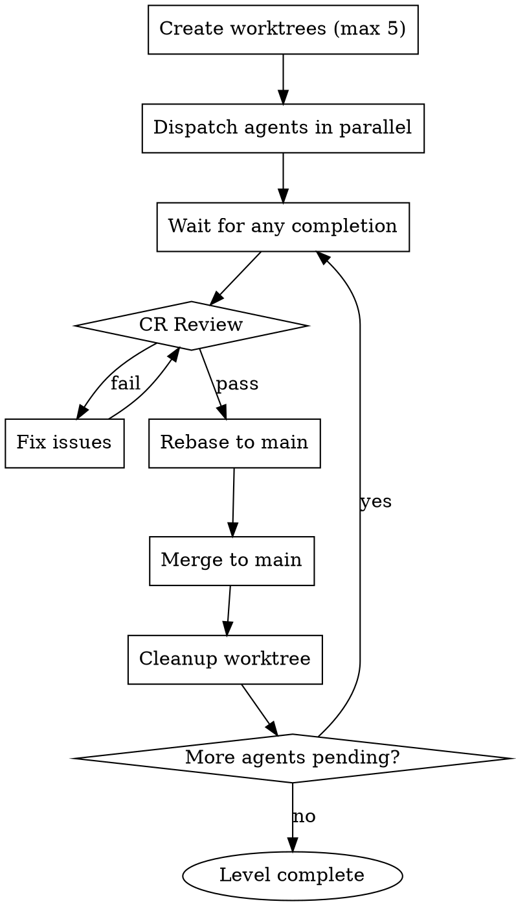
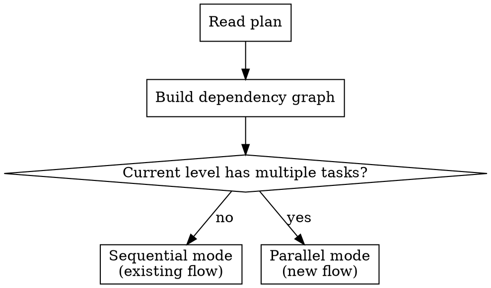
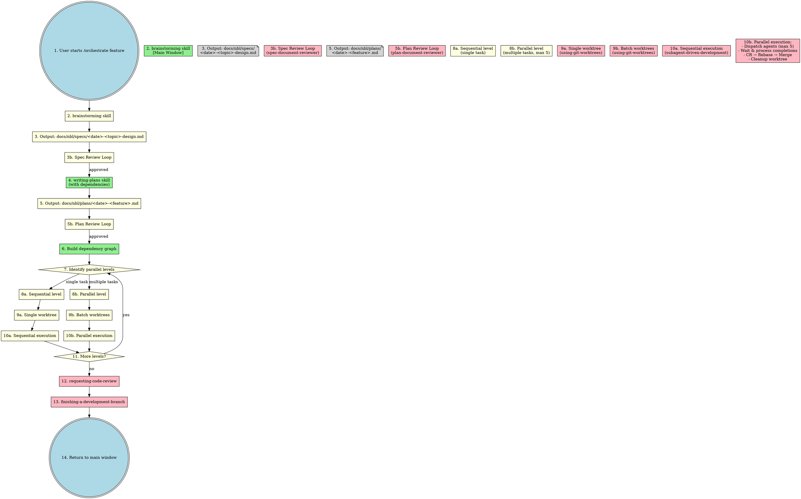

# 并行任务执行功能实现计划

> **For agentic workers:** REQUIRED SUB-SKILL: Use nbl.subagent-driven-development (recommended) or nbl.executing-plans to implement this plan task-by-task. Steps use checkbox (`- [ ]`) syntax for tracking.

**Goal:** 为 Claude Code Skills 项目增加计划任务并行执行能力

**Architecture:** 扩展现有 4 个 skill，增加依赖标注、并行执行、批量 worktree 管理等功能

**Tech Stack:** Markdown skill 文件，无代码依赖

**Spec:** `docs/nbl/specs/2026-03-26-parallel-task-execution-design.md`

---

## Task 1: 更新 writing-plans 任务依赖标注规范

**Dependencies:** None
**Parallelizable:** Yes
**Files:**
- Modify: `skills/nbl.writing-plans/SKILL.md`

**Goal:** 在 writing-plans 中增加任务依赖标注规范，让计划文档包含 Dependencies 和 Parallelizable 字段。

---

- [ ] **Step 1: 读取现有 writing-plans SKILL.md**

使用 Read 工具读取 `skills/nbl.writing-plans/SKILL.md`，了解现有结构和内容。

- [ ] **Step 2: 添加 Task Dependencies 章节**

在 Task Structure 章节之前，添加新的 `## Task Dependencies` 章节：

```markdown
## Task Dependencies

Each task MUST include dependency information for parallel execution planning:

### Required Fields

**Dependencies:** `None` | `Task 1, Task 2, ...`
- List task numbers this task depends on
- Use `None` if task has no dependencies

**Parallelizable:** `Yes` | `No (reason)`
- `Yes` - Task can run in parallel with other independent tasks
- `No (reason)` - Task must wait for dependencies, explain why

### Task Granularity Rules (NON-NEGOTIABLE)

**Rule:** One task = one independently testable feature unit

| Type | Example | Allowed |
|------|---------|---------|
| ✅ Feature module | "User authentication module" | Yes |
| ✅ Independent subsystem | "Logging service" | Yes |
| ❌ By code layer | "Auth API" + "Auth Service" + "Auth Mapper" | No |
| ❌ Too granular | "Add field X" + "Add field Y" | No |

**Why:** Tasks split by code layer create artificial dependencies and merge conflicts. Split by feature boundaries instead.
```

- [ ] **Step 3: 更新 Task Structure 示例**

更新现有的 Task Structure 示例，包含新的依赖字段：

```markdown
### Task N: [Component Name]

**Dependencies:** None | Task 1, Task 2
**Parallelizable:** Yes | No (reason if No)
**Files:**
- Create: `exact/path/to/file.py`
- Modify: `exact/path/to/existing.py:123-145`
- Test: `tests/exact/path/to/test.py`

- [ ] **Step 1: Write the failing test**
...
```

- [ ] **Step 4: Commit changes**

```bash
git add skills/nbl.writing-plans/SKILL.md
git commit -m "feat(writing-plans): add task dependency annotation spec"
```

---

## Task 2: 更新 using-git-worktrees 批量操作

**Dependencies:** None
**Parallelizable:** Yes
**Files:**
- Modify: `skills/nbl.using-git-worktrees/SKILL.md`

**Goal:** 增加 worktree 批量创建、清理和并行模式命名规范。

---

- [ ] **Step 1: 读取现有 using-git-worktrees SKILL.md**

使用 Read 工具读取 `skills/nbl.using-git-worktrees/SKILL.md`。

- [ ] **Step 2: 添加 Batch Operations 章节**

在 Quick Reference 表格之前，添加新章节：

```markdown
## Batch Operations (Parallel Mode)

When executing parallel tasks, create and manage multiple worktrees.

### Create Multiple Worktrees

```bash
# For parallel tasks in a level
for task_id in 1 3 5; do
    git worktree add ".worktrees/${BRANCH}-task${task_id}" -b "${BRANCH}-task${task_id}"
done
```

### Cleanup Multiple Worktrees

After a task is merged:

```bash
# Remove single worktree after merge
git worktree remove ".worktrees/${BRANCH}-task${task_id}"
git branch -d "${BRANCH}-task${task_id}"
```

### Naming Convention (Parallel Mode)

```
.worktrees/
├── feature-auth-task1/      # Task 1 worktree
├── feature-logging-task3/   # Task 3 worktree
├── feature-audit-task4/     # Task 4 worktree
└── feature-main/            # Base branch (optional)
```

**Format:** `{branch-prefix}-{task-name}-{task-id}`
```

- [ ] **Step 3: 更新 Integration 章节**

在 Integration 章节添加并行模式说明：

```markdown
**Parallel mode integration:**
- **subagent-driven-development (parallel mode)** - Creates batch worktrees for parallel tasks
- Maximum 5 parallel worktrees at a time
```

- [ ] **Step 4: Commit changes**

```bash
git add skills/nbl.using-git-worktrees/SKILL.md
git commit -m "feat(using-git-worktrees): add batch operations for parallel mode"
```

---

## Task 3: 更新 subagent-driven-development 并行执行模式

**Dependencies:** Task 1, Task 2
**Parallelizable:** No (依赖 Task 1 的依赖标注规范和 Task 2 的批量 worktree 操作)
**Files:**
- Modify: `skills/nbl.subagent-driven-development/SKILL.md`

**Goal:** 增加并行执行模式，包括依赖图构建、并行调度、Rebase+Merge 流程。

---

- [ ] **Step 1: 读取现有 subagent-driven-development SKILL.md**

使用 Read 工具读取 `skills/nbl.subagent-driven-development/SKILL.md`。

- [ ] **Step 2: 添加 Execution Mode 章节**

在 When to Use 流程图之后，添加新章节：

```markdown
## Execution Mode

After reading the plan, analyze task dependencies to determine execution mode.

### Dependency Graph Analysis

```python
# Pseudocode
def analyze_plan(plan):
    for task in plan.tasks:
        if task.dependencies == None:
            task.level = 0
        else:
            task.level = max(dep.level for dep in task.dependencies) + 1

    levels = group_by_level(tasks)
    return levels
```

### Level-Based Execution

```
Level 0 (parallel): Task 1, Task 3      # No dependencies
        ↓
Level 1 (parallel): Task 2, Task 4      # Depends on Level 0
        ↓
Level 2: ...                            # Depends on Level 1
```

**Rule:** All tasks in a level must complete before Level+1 starts.
```

- [ ] **Step 3: 添加 Parallel Execution 章节**

```markdown
## Parallel Execution Mode

When a level has multiple independent tasks:

### Parallel Limit

**MAX_PARALLEL_AGENTS = 5**

If level has more than 5 tasks, split into batches.

### Execution Flow



### Rebase + Merge Process

For each completed agent:

1. **CR Review** - Use spec-reviewer + code-quality-reviewer
2. **Rebase** - `git rebase main` (handle conflicts if any)
3. **Merge** - `git merge --ff-only` into main
4. **Cleanup** - Remove worktree and branch

### Error Handling

| Scenario | Action |
|----------|--------|
| CR fails | Agent fixes, re-review |
| Agent blocked | Main agent provides context or re-dispatches |
| Rebase conflict | Main agent resolves |
| Merge fails | Rollback, fix, retry |
```

- [ ] **Step 4: 更新 Process 流程图**

在现有 process 流程图之前，添加模式选择逻辑：

```markdown
## Mode Selection


```

- [ ] **Step 5: 更新 Red Flags 章节**

添加并行模式的 Red Flags：

```markdown
**Parallel mode red flags:**
- Never dispatch more than 5 agents simultaneously
- Never skip CR before merge
- Never merge without rebasing first
- Never proceed to next level with failed agents
- Never ignore rebase conflicts
```

- [ ] **Step 6: Commit changes**

```bash
git add skills/nbl.subagent-driven-development/SKILL.md
git commit -m "feat(subagent-driven-development): add parallel execution mode"
```

---

## Task 4: 更新 orchestrate 流程图

**Dependencies:** Task 3
**Parallelizable:** No (需要先完成 subagent-driven-development 的更新)
**Files:**
- Modify: `skills/nbl.orchestrate/SKILL.md`

**Goal:** 更新 Feature Workflow 流程图，体现并行执行分支。

---

- [ ] **Step 1: 读取现有 orchestrate SKILL.md**

使用 Read 工具读取 `skills/nbl.orchestrate/SKILL.md`。

- [ ] **Step 2: 替换 Complete Feature Workflow 流程图**

将现有的 `orchestrate_feature_workflow` 替换为新版本：



- [ ] **Step 3: 更新 Skill Dependencies 表格**

在 Skill Dependencies 表格中添加并行模式说明：

```markdown
| Skill | Execution | Purpose |
|-------|-----------|---------|
| **orchestrate** | Main window | Unified entry point |
| **brainstorming** | Main window | Requirements clarification |
| **writing-plans** | Subagent | Detailed plan with task dependencies |
| **using-git-worktrees** | Subagent | Isolated workspace (single or batch) |
| **subagent-driven-development** | Subagent | Task execution (sequential or parallel, max 5) |
| **test-driven-development** | Subagent | TDD cycle |
| **requesting-code-review** | Subagent | Code review |
| **receiving-code-review** | Subagent | Handle CR feedback |
| **finishing-a-development-branch** | Subagent | Complete branch |
```

- [ ] **Step 4: Commit changes**

```bash
git add skills/nbl.orchestrate/SKILL.md
git commit -m "feat(orchestrate): update workflow for parallel execution"
```

---

## Task 5: 验收测试

**Dependencies:** Task 1, Task 2, Task 3, Task 4
**Parallelizable:** No
**Files:**
- None (验证性任务)

**Goal:** 验证所有修改符合 spec 要求。

---

- [ ] **Step 1: 检查文件修改完整性**

确认以下文件已修改：
- [ ] `skills/nbl.writing-plans/SKILL.md` - 包含 Task Dependencies 章节
- [ ] `skills/nbl.using-git-worktrees/SKILL.md` - 包含 Batch Operations 章节
- [ ] `skills/nbl.subagent-driven-development/SKILL.md` - 包含 Parallel Execution 章节
- [ ] `skills/nbl.orchestrate/SKILL.md` - 流程图已更新

- [ ] **Step 2: 对照 spec 检查内容**

对照 `docs/nbl/specs/2026-03-26-parallel-task-execution-design.md` 检查：
- [ ] 任务依赖标注规范 (Section 2)
- [ ] 依赖图与并行层级 (Section 3)
- [ ] 并行执行核心流程 (Section 4)
- [ ] 最大并行数限制 = 5 (Section 5)
- [ ] Worktree 命名规范 (Section 7)

- [ ] **Step 3: 最终提交**

```bash
git add -A
git commit -m "feat: add parallel task execution support

- writing-plans: add task dependency annotation spec
- using-git-worktrees: add batch operations for parallel mode
- subagent-driven-development: add parallel execution mode (max 5 agents)
- orchestrate: update workflow for parallel execution

Spec: docs/nbl/specs/2026-03-26-parallel-task-execution-design.md"
```

---

## 验收标准

- [ ] `writing-plans` 支持任务依赖标注
- [ ] `using-git-worktrees` 支持批量创建/清理
- [ ] `subagent-driven-development` 支持并行模式
- [ ] 最大并行数限制为 5
- [ ] Rebase + Merge 流程已定义
- [ ] 错误处理场景已覆盖
- [ ] `orchestrate` 流程图已更新
