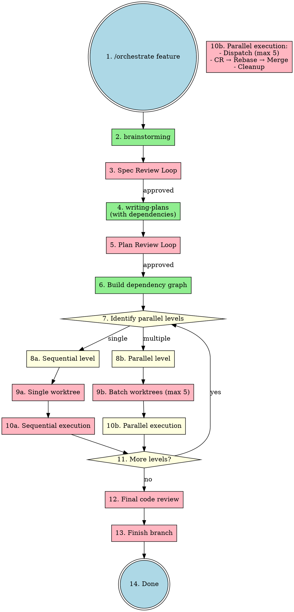

# 并行任务执行设计规范

> **For agentic workers:** 本文档定义了计划任务的并行执行模式，需与 `nbl.subagent-driven-development` 配合使用。

**Goal:** 支持多个独立任务并行执行，加速开发效率，同时保证代码质量。

**Date:** 2026-03-26

---

## 1. 概述

### 1.1 背景

当前 `nbl.subagent-driven-development` 采用顺序执行模式，即使计划中的多个任务相互独立，也只能逐个执行。本设计增加并行执行能力，让独立任务可以同时由多个 agent 处理。

### 1.2 核心原则

- **功能模块级粒度**：任务拆分以功能模块为单位，禁止按代码层（api/service/mapper）拆分
- **并行执行，顺序合并**：多个 agent 并行工作，但逐个完成 CR 和合并
- **Rebase 模式**：合并前 rebase 到最新主分支，保持线性历史
- **最大并行数限制**：最多同时运行 5 个 agent

---

## 2. 任务依赖标注规范

### 2.1 必填字段

每个任务必须包含以下依赖信息：

```markdown
### Task N: [Task Name]

**Dependencies:** None | Task 1, Task 2, ...
**Parallelizable:** Yes | No (reason if No)
**Files:**
- Create: `path/to/file.py`
- Modify: `path/to/existing.py`
```

### 2.2 任务粒度规范 (NON-NEGOTIABLE)

| 类型 | 示例 | 是否允许 |
|------|------|---------|
| ✅ 功能模块 | "User authentication module" | Yes |
| ✅ 独立子系统 | "Logging service" | Yes |
| ❌ 按代码层拆分 | "Auth API" + "Auth Service" + "Auth Mapper" | No |
| ❌ 过细粒度 | "Add field X" + "Add field Y" | No |

**规则**：一个任务 = 一个可独立测试的功能单元

### 2.3 标注示例

```markdown
### Task 1: 用户认证模块
**Dependencies:** None
**Parallelizable:** Yes
**Files:** `api/src/auth/*`, `app/src/auth/*`

### Task 2: 权限校验中间件
**Dependencies:** Task 1
**Parallelizable:** No (依赖 Task 1 的接口定义)
**Files:** `api/src/middleware/*`

### Task 3: 日志服务
**Dependencies:** None
**Parallelizable:** Yes
**Files:** `api/src/logging/*`

### Task 4: 审计模块
**Dependencies:** Task 1, Task 3
**Parallelizable:** No (依赖认证和日志)
**Files:** `api/src/audit/*`
```

---

## 3. 依赖图与并行层级

### 3.1 依赖图构建

读取计划后，自动构建依赖图：

```
Task 1 (auth) ──────┬───→ Task 2 (middleware)
                    │
                    └───→ Task 4 (audit)
                              ↑
Task 3 (logging) ────────────┘
```

### 3.2 拓扑排序

将任务分层，同一层级的任务可并行执行：

```
Level 0 (可并行): Task 1 (auth), Task 3 (logging)
        ↓
Level 1 (可并行): Task 2 (middleware), Task 4 (audit)
        ↓
Level 2: ... (如有)
```

### 3.3 执行逻辑

```python
# 伪代码
MAX_PARALLEL_AGENTS = 5

def execute_plan(plan):
    dependency_graph = build_graph(plan.tasks)
    levels = topological_sort(dependency_graph)

    for level in levels:
        if len(level) == 1:
            # 单任务，顺序执行
            execute_sequential(level[0])
        else:
            # 多任务，并行执行
            execute_parallel(level)

def execute_parallel(level_tasks):
    batch_size = min(len(level_tasks), MAX_PARALLEL_AGENTS)

    for batch in chunks(level_tasks, batch_size):
        # 1. 创建 worktrees
        # 2. 并行 dispatch agents
        # 3. 等待完成 → CR → Rebase → Merge → 清理
        # 4. 处理下一批次
```

---

## 4. 并行执行核心流程

### 4.1 流程图

```
┌─────────────────────────────────────────────────────────────────┐
│                   Level N: 3 个可并行任务                        │
├─────────────────────────────────────────────────────────────────┤
│  1. 创建 Worktrees                                               │
│     worktree-task1    worktree-task2    worktree-task3          │
│           │                │                │                   │
│  2. 并行 Dispatch Agents                                         │
│     Agent 1           Agent 2           Agent 3                 │
│     (Task 1)          (Task 2)          (Task 3)                │
│           │                │                │                   │
│  3. 并行执行中...                                               │
└─────────────────────────────────────────────────────────────────┘
                           │
                           ▼ (任一完成)
              ┌────────────────────────┐
              │   等待任意 Agent 完成    │
              └───────────┬────────────┘
                          ▼
              ┌────────────────────────┐
              │   CR Review            │
              │   通过? ──否──► 修复   │
              └───────────┬────────────┘
                          │ 是
                          ▼
              ┌────────────────────────┐
              │   Rebase to main       │
              │   (处理冲突)            │
              └───────────┬────────────┘
                          ▼
              ┌────────────────────────┐
              │   Merge to main        │
              └───────────┬────────────┘
                          ▼
              ┌────────────────────────┐
              │   Cleanup worktree     │
              └───────────┬────────────┘
                          ▼
              ┌────────────────────────┐
              │   还有未处理的 Agent?   │
              │   是 ──► 等待下一个完成  │
              │   否 ──► Level 完成     │
              └────────────────────────┘
```

### 4.2 关键步骤

| 步骤 | 说明 |
|------|------|
| **创建 Worktrees** | 为每个并行任务创建独立工作区 |
| **并行 Dispatch** | 同时启动多个 agent（最多 5 个）|
| **等待完成** | 任一 agent 完成即开始处理 |
| **CR Review** | 逐个进行代码审查 |
| **Rebase** | 合并前同步到最新主分支 |
| **Merge** | 合并到主分支 |
| **Cleanup** | 清理已完成的 worktree |

### 4.3 冲突处理

- Rebase 时如果发生冲突，由**主 agent**（orchestrate 的 controller agent）处理
- 冲突解决后继续 merge 流程

### 4.4 错误处理

| 场景 | 处理方式 |
|------|---------|
| Agent CR 不通过 | Agent 修复后重新 CR，阻塞后续合并 |
| Agent 执行失败 | 主 agent 评估：提供更多 context 重试，或拆分任务 |
| Rebase 冲突无法解决 | 上报用户决策 |
| 合并后测试失败 | 回滚该合并，修复后重新合并 |

**规则**：一个 agent 失败不阻塞其他并行 agent 的执行，但阻塞后续合并

---

## 5. 最大并行数限制

### 5.1 限制规则

- **最大并行 agent 数**：5 个
- 超过 5 个任务时，分批执行

### 5.2 分批示例

| 任务数 | 执行批次 |
|--------|---------|
| 3 个 | 1 批：3 个并行 |
| 5 个 | 1 批：5 个并行 |
| 8 个 | 2 批：5 + 3 |
| 12 个 | 3 批：5 + 5 + 2 |

---

## 6. 文件修改清单

### 6.1 `nbl.writing-plans/SKILL.md`

**新增内容：**
- 任务依赖标注规范（Dependencies, Parallelizable 字段）
- 任务粒度规范（功能模块级别，禁止按代码层拆分）

### 6.2 `nbl.using-git-worktrees/SKILL.md`

**新增内容：**
- 批量创建 worktree 方法
- 批量清理 worktree 方法
- 并行模式命名规范（`{branch}-{task-id}`）

### 6.3 `nbl.subagent-driven-development/SKILL.md`

**新增内容：**
- 依赖图构建逻辑
- 并行执行模式
- 最大并行数限制（5）
- Rebase + Merge 流程
- 冲突处理机制

### 6.4 `nbl.orchestrate/SKILL.md`

**更新内容：**
- Feature Workflow 流程图（增加并行执行分支）
- 决策逻辑更新

---

## 7. Worktree 命名规范

### 7.1 目录结构

```
.worktrees/
├── feature-auth-task1/     # Task 1 的 worktree
├── feature-logging-task3/  # Task 3 的 worktree
├── feature-audit-task4/    # Task 4 的 worktree
└── feature-main/           # 主 worktree (可选)
```

### 7.2 命名规则

```
{branch-prefix}-{task-name}-{task-id}
```

示例：`feature-user-auth-task1`

---

## 8. 完整执行流程图



---

## 9. 验收标准

- [ ] `writing-plans` 支持任务依赖标注
- [ ] `using-git-worktrees` 支持批量创建/清理
- [ ] `subagent-driven-development` 支持并行模式
- [ ] 最大并行数限制为 5
- [ ] Rebase + Merge 流程正常工作
- [ ] 冲突可由主 agent 处理
- [ ] `orchestrate` 流程图已更新
