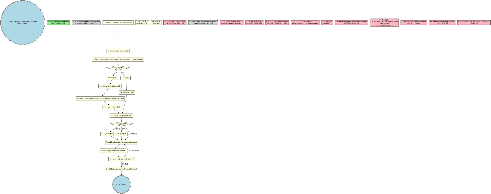
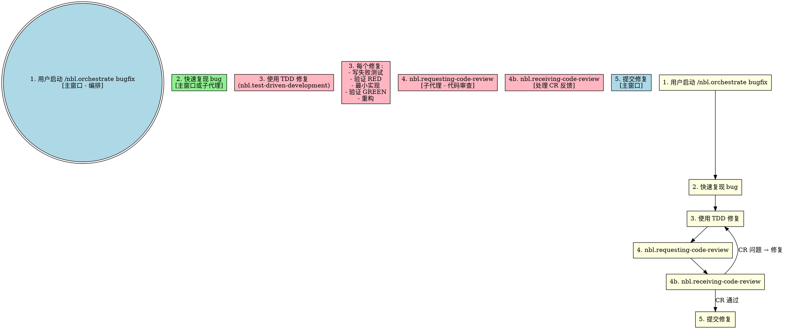

# Orchestrate Skill 重构设计方案

> **日期:** 2026-03-26
> **目标:** 重构 Claude Code 项目，实现 superpowers 风格的工作流编排
> **状态:** ✅ 已完成 (2026-03-26)

## 背景

当前项目存在以下问题：
- `nbl.orchestrate` skill 定义不清晰，与其他 skills 关系模糊
- agents 目录独立存在，增加了系统复杂度
- 缺少 superpowers 中经过验证的工作流模式
- 主窗口承担了过多实现工作，应该专注于编排

## 设计目标

1. **统一入口**: `nbl.orchestrate` 成为所有开发工作流的唯一入口
2. **子代理执行**: 所有实现工作通过子代理执行，主窗口仅做编排和用户交互
3. **skill 整合**: 吸收 superpowers 中的精华 skills
4. **文件输出**: 大需求输出设计文档和执行计划到 `docs/superpowers/`

## 工作流设计

### 完整 Feature 开发流程



### Bugfix 工作流



## Skills 目录结构

```
skills/
├── nbl.orchestrate/                # ⭐ 统一工作流入口
│   ├── SKILL.md                    # 主编排文件
│   ├── workflow-graphs.dot         # DOT 工作流图
│   └── subagent-templates.md       # 子代理模板
│
├── nbl.brainstorming/              # ⭐ 需求澄清
│   ├── SKILL.md
│   └── visual-companion.md
│
├── nbl.writing-plans/              # ⭐ 详细计划
│   ├── SKILL.md
│   └── plan-document-reviewer-prompt.md
│
├── nbl.subagent-driven-development/# ⭐ 子代理执行
│   ├── SKILL.md
│   ├── implementer-prompt.md
│   ├── spec-reviewer-prompt.md
│   └── code-quality-reviewer-prompt.md
│
├── nbl.test-driven-development/    # ⭐ TDD
│   └── SKILL.md
│
├── nbl.using-git-worktrees/        # ⭐ 隔离工作区
│   └── SKILL.md
│
├── nbl.requesting-code-review/     # ⭐ 请求CR
│   ├── SKILL.md
│   └── code-reviewer.md
│
├── nbl.receiving-code-review/      # ⭐ 处理CR
│   └── SKILL.md
│
├── nbl.dispatching-parallel-agents/# ⭐ 并行调度
│   └── SKILL.md
│
├── nbl.finishing-a-development-branch/ # ⭐ 完成分支
│   └── SKILL.md
│
├── nbl.plan/                       # 轻量计划
│   └── SKILL.md
│
├── nbl.update-codemaps/            # 更新代码地图
│   └── SKILL.md
│
└── [其他 skills]
```

## 执行职责分配

| 执行位置 | Skills | 说明 |
|---------|--------|------|
| **主窗口** | nbl.orchestrate, nbl.brainstorming | 工作流编排、需求澄清 |
| **子代理** | nbl.writing-plans, nbl.plan, nbl.subagent-driven-development, nbl.test-driven-development, nbl.using-git-worktrees, nbl.requesting-code-review, nbl.receiving-code-review, nbl.dispatching-parallel-agents, nbl.finishing-a-development-branch | 所有实现工作 |

## 文件输出位置

| 文件类型 | 路径 |
|---------|------|
| **设计文档** (大需求) | `docs/superpowers/specs/YYYY-MM-DD-<topic>-design.md` |
| **执行计划** (大需求) | `docs/superpowers/plans/YYYY-MM-DD-<feature>.md` |
| **代码** | `skills/` 目录 |

## 已删除

- `agents/` 目录 (所有 agents 替换为子代理 skill 执行)

## 注意事项

- 所有 skills 使用 `nbl.xxx` 命名规范
- 路径引用使用相对路径
- DOT 图使用标准的 graphviz 语法
- 子代理模板使用 Markdown 格式

## 实施结果

### 已完成迁移的 Skills

| Skill | 描述 |
|-------|------|
| **nbl.brainstorming** | 需求澄清和规格文档生成 |
| **nbl.writing-plans** | 详细实现计划生成 |
| **nbl.subagent-driven-development** | 子代理驱动开发模式 |
| **nbl.dispatching-parallel-agents** | 并行代理调度 |
| **nbl.requesting-code-review** | 请求代码审查 |
| **nbl.receiving-code-review** | 处理代码审查反馈 |
| **nbl.finishing-a-development-branch** | 完成开发分支 |
| **nbl.orchestrate** | 统一工作流入口点 |

### 提交

- `e599d19` - refactor(skills): 统一命名规范为 nbl.xxx 格式
- `886f548` - feat(skills): 迁移 superpowers skills 到本地 skills 目录
