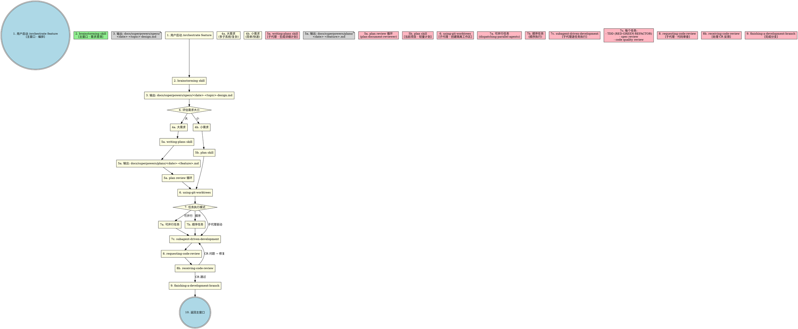
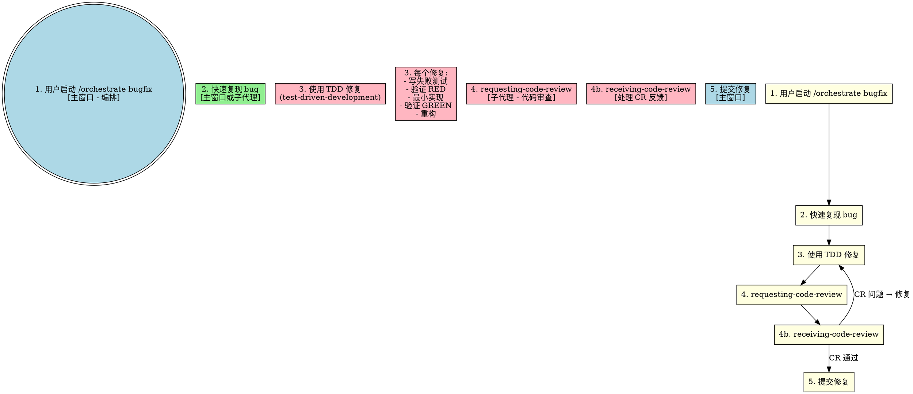

# Orchestrate Skill 重构设计方案

> **日期:** 2026-03-26
> **目标:** 重构 Claude Code 项目，实现 superpowers 风格的工作流编排

## 背景

当前项目存在以下问题：
- `orchestrate` skill 定义不清晰，与其他 skills 关系模糊
- agents 目录独立存在，增加了系统复杂度
- 缺少 superpowers 中经过验证的工作流模式
- 主窗口承担了过多实现工作，应该专注于编排

## 设计目标

1. **统一入口**: `orchestrate` 成为所有开发工作流的唯一入口
2. **子代理执行**: 所有实现工作通过子代理执行，主窗口仅做编排和用户交互
3. **skill 整合**: 吸收 superpowers 中的精华 skills
4. **文件输出**: 大需求输出设计文档和执行计划到 `docs/superpowers/`

## 工作流设计

### 完整 Feature 开发流程



### Bugfix 工作流



## Skills 目录结构

```
skills/
├── orchestrate/                    # ⭐ 统一工作流入口
│   ├── SKILL.md                   # 主编排文件 (重新设计)
│   ├── workflow-graphs.dot        # DOT 工作流图
│   └── subagent-templates.md      # 子代理模板
│
├── brainstorming/                 # ⭐ 从 superpowers 复制
│   ├── SKILL.md
│   └── visual-companion.md
│
├── writing-plans/                  # ⭐ 从 superpowers 复制
│   ├── SKILL.md
│   └── plan-document-reviewer-prompt.md
│
├── subagent-driven-development/    # ⭐ 从 superpowers 复制
│   ├── SKILL.md
│   ├── implementer-prompt.md
│   ├── spec-reviewer-prompt.md
│   └── code-quality-reviewer-prompt.md
│
├── test-driven-development/        # ⭐ 从 superpowers 复制
│   └── SKILL.md
│
├── using-git-worktrees/            # ⭐ 从 superpowers 复制
│   └── SKILL.md
│
├── requesting-code-review/          # ⭐ 从 superpowers 复制
│   ├── SKILL.md
│   └── code-reviewer.md
│
├── receiving-code-review/          # ⭐ 从 superpowers 复制
│   └── SKILL.md
│
├── dispatching-parallel-agents/    # ⭐ 从 superpowers 复制
│   └── SKILL.md
│
├── finishing-a-development-branch/ # ⭐ 从 superpowers 复制
│   └── SKILL.md
│
├── plan/                           # 保留 (小需求轻量计划)
│   └── SKILL.md
│
├── code-review/                    # 整合 (superpowers + 当前项目)
│   └── SKILL.md
│
├── update-codemaps/                # 保留
│   └── SKILL.md
│
└── [其他现有 skills]              # 保留
```

## 执行职责分配

| 执行位置 | Skills | 说明 |
|---------|--------|------|
| **主窗口** | orchestrate, brainstorming | 工作流编排、需求澄清 |
| **子代理** | writing-plans, plan, subagent-driven-development, test-driven-development, using-git-worktrees, requesting-code-review, receiving-code-review, dispatching-parallel-agents, finishing-a-development-branch | 所有实现工作 |

## 文件输出位置

| 文件类型 | 路径 |
|---------|------|
| **设计文档** (大需求) | `docs/superpowers/specs/YYYY-MM-DD-<topic>-design.md` |
| **执行计划** (大需求) | `docs/superpowers/plans/YYYY-MM-DD-<feature>.md` |
| **代码** | `skills/` 目录 |

## 待删除

- `agents/` 整个目录 (所有 agents 替换为子代理 skill 执行)

## 迁移策略

1. **逐个复制**: 从 superpowers 逐个复制 skills，保持英文原文
2. **路径调整**: 内部引用路径从 `superpowers:xxx` 调整为 `xxx`
3. **整合**: `code-review` skill 整合 superpowers + 当前项目
4. **重新设计**: `orchestrate` 重新设计为统一入口

## 注意事项

- 所有 skills 保持英文原文，确保功能准确性
- 路径引用使用相对路径
- DOT 图使用标准的 graphviz 语法
- 子代理模板使用 Markdown 格式
