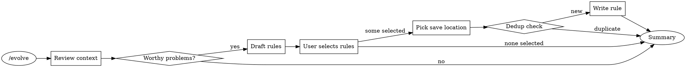

# Evolve — Turn Mistakes Into Rules

When the same mistake happens twice, it's not a mistake anymore — it's a missing rule.

This skill captures lessons from the current session and writes them where they'll actually be read: global config, project config, or category-specific rule files. The key insight is that a rule is only useful if it's specific enough to prevent the error but general enough to apply next time.

## Anti-Pattern: "Just Add It To The List"

Not every correction deserves a rule. A typo fix doesn't need a rule. A one-off configuration error doesn't need a rule. What deserves a rule is a **pattern** — something that happened because of a missing guardrail in the development process, not because of momentary carelessness.

Good candidates:
- A convention violation that a review caught (means the process didn't prevent it)
- A business logic error that reveals an unclear requirement
- A recurring mistake you've now seen more than once
- A non-obvious constraint that caused a bug (hidden dependencies, edge cases)

Bad candidates:
- Simple typos or copy-paste accidents
- Mistakes caused by unclear specs that have since been clarified
- One-off environmental issues (server was down, config was wrong)

## Flow



## Step 1 — Context Review

Look back through the current conversation for problems worth codifying. Focus on:

- Issues identified by `/review`, `/simplify`, or manual code review
- Business logic errors that were caught and corrected
- Convention violations that slipped through

Present what you found as a numbered list. Be specific — cite the actual code, file, or logic that was problematic, not vague summaries. The user needs to recognize the problem to judge if it's rule-worthy.

If nothing rule-worthy shows up, say so honestly: "No recurring patterns or convention gaps found in this session — nothing to evolve." and stop.

Use AskUserQuestion to get confirmation before investing effort in drafting:

> Question: "Found N issues that look like missing rules. Draft rules for them?"
> Options:
> - label: "Yes, draft rules" — proceed to Step 2
> - label: "No, cancel" — exit

## Step 2 — Rule Generation

For each confirmed problem, draft a rule. The rule should capture the **principle**, not the specific instance. A rule about one particular variable name is too narrow; a rule about the naming pattern that led to the mistake is useful.

Rule forms that work well:
- `NEVER <anti-pattern>` — for things that must not be done
- `ALWAYS <correct-pattern>` — for things that must always be done
- `When <condition>, use <approach>` — for context-dependent guidance

Present all drafted rules at once using AskUserQuestion with multiSelect. The user picks which ones to save — they may accept all, some, or none. If none selected, exit gracefully.

Example of what the AskUserQuestion should look like:

> Question: "Drafted rules from this session's issues. Select which to save:"
> Options (multiSelect):
> - label: "NEVER concatenate SQL strings in Service layer — always use Mapper methods"
> - label: "ALWAYS validate external API responses before processing"
> - label: "NEVER use magic numbers — extract to named constants"

## Step 3 — Save Location

For each selected rule, pick the right home. The location determines who benefits — global rules help every project, project rules help this team, and rules files help organize by domain.

Use AskUserQuestion to present options. The rules file option should be marked as recommended when the rule clearly belongs to an existing category.

> Question: "Where to save: 'NEVER concatenate SQL strings in Service layer'?"
> Options:
> - label: "Global (~/.claude/CLAUDE.md)", description: "Cross-project — applies everywhere"
> - label: "Project (CLAUDE.md)", description: "This project only"
> - label: "rules/coding-conventions.md (Recommended)", description: "Coding convention domain — lives with related rules"

### Rules file mapping

When recommending a rules file, check what exists in the project's `rules/common/` directory first (that's the source-of-truth with git history). Fall back to `~/.claude/rules/` if no project rules directory exists. Match by domain:

| Domain | File |
|--------|------|
| Architecture, layering, module design | `architecture.md` |
| Class/method/parameter naming | `naming.md` |
| Spring injection, data persistence, coding patterns | `coding-conventions.md` |
| Code style, immutability, error handling | `coding-style.md` |
| Git, PRs, commit messages | `git-workflow.md` |
| Testing, coverage, TDD | `testing.md` |
| Development lifecycle, workflow | `development-workflow.md` |

If the rules directory is not found, only offer the two CLAUDE.md options and explain why.

## Step 4 — Dedup & Write

Process each rule sequentially — read, check, then write. This order matters because you need the file contents to do a meaningful duplicate check.

### Read target file

Read the full contents of the target file. You need to see existing rules to judge duplication.

### Duplicate check

Check for **semantic overlap**, not exact string match. The whole point of this check is to prevent two rules that say the same thing in different words from cluttering the file.

These are duplicates (same intent, different words):
- "Never use magic numbers" ≈ "Avoid hardcoded numeric literals"
- "Always use parameterized queries" ≈ "Never interpolate user input into SQL"

These are NOT duplicates (different aspects of related topics):
- "Always use Mapper for SQL" vs "Never concatenate SQL strings" — one says what to use, the other says what to avoid
- "Validate API responses" vs "Handle null checks on DTOs" — different scope

### Write

If the rule is new:
- Look for an existing section header that fits (e.g., `## SQL Guidelines`)
- Found a match → append the rule under that section using Edit
- No match → append at the end of the file with a new `##` section header

If the rule duplicates an existing one:
- Tell the user exactly which existing rule covers it
- Skip writing — no one benefits from redundancy

## Summary Report

After all rules are processed, give a clear summary so the user knows what changed:

```
Evolve complete:
- 2 rules saved:
  - "NEVER use magic numbers" → rules/coding-conventions.md
  - "ALWAYS validate API responses" → ~/.claude/CLAUDE.md
- 1 duplicate skipped:
  - "Use Mapper for SQL" — already covered by existing rule in rules/coding-conventions.md
```

If nothing was written: "Evolve complete — no changes made."

## Edge Cases

| Case | What to do |
|------|------------|
| No problems found | Say so and exit — don't force it |
| User cancels at any step | Exit cleanly, nothing written |
| Rules directory missing | Offer only global/project CLAUDE.md, explain why |
| No matching section in file | Append at end with new section header |
| All rules are duplicates | Report all as skipped, suggest the rules are working |
