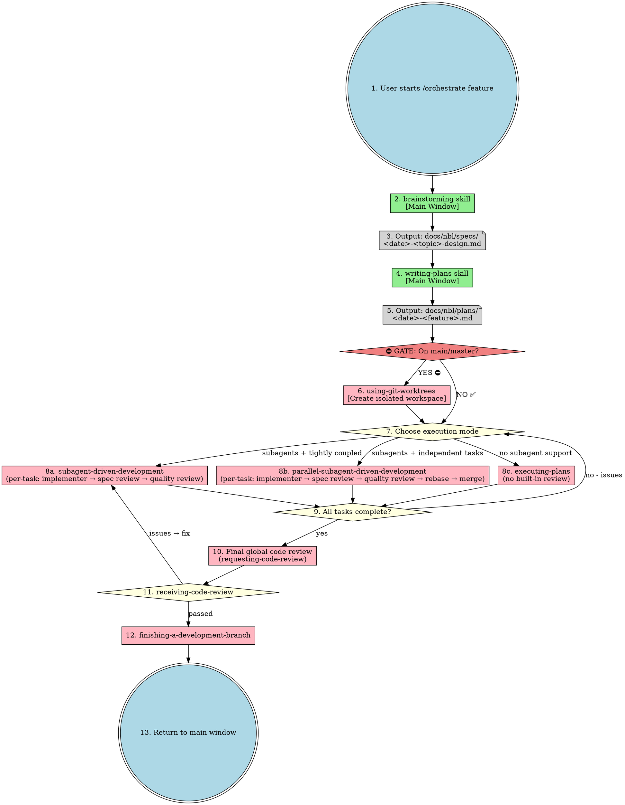
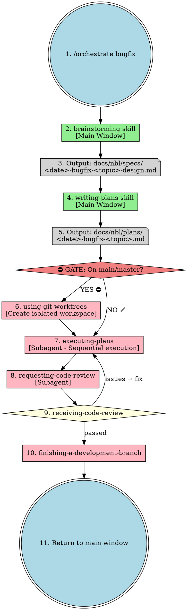

# Orchestrate Skill

Unified workflow orchestration entry point. All implementation happens in subagents. Main window handles orchestration and user interaction only.

**Core principle:** One entry point, all execution in subagents.

## Entry Points

```
/orchestrate feature "<description>"  - Feature development workflow
/orchestrate bugfix "<description>"   - Bug fix workflow
```

## ⛔ CRITICAL: Planning → Execution Transition Gate

**This check MUST happen BEFORE calling any execution skill.**

```
┌─────────────────────────────────────────────────────────────────┐
│  TRANSITION GATE: Planning → Execution                          │
│                                                                 │
│  When user says "continue execution" or "start execution":      │
│                                                                 │
│  1. Run: git branch --show-current                              │
│  2. If result is "main" or "master":                            │
│     ⛔ STOP → Invoke nbl.using-git-worktrees skill               │
│     → Then proceed to execution                                 │
│  3. If result is any other branch (including worktree):         │
│     ✅ OK → Proceed to execution directly                        │
│                                                                 │
│  NEVER call execution skills while on main/master               │
└─────────────────────────────────────────────────────────────────┘
```

**Why this matters:**
- Planning phase happens on main/master (reading docs, writing specs/plans)
- Execution phase modifies code and MUST be isolated
- This gate ensures the transition is explicit and safe

## Complete Feature Workflow



### Code Review 出现在两个层级

| 层级 | 时机 | 内容 | 处理方式 |
|------|------|------|---------|
| **任务级**（内置在 8a/8b 中） | 每个任务完成后 | Stage 1: Spec Review → Stage 2: Quality Review | 实现子代理修复 → 重新审查 → 循环直到通过 |
| **全局级**（步骤 10-11） | 所有任务完成后 | 整体代码审查 | receiving-code-review 处理反馈 → 有问题则返回修复 → 通过则继续 |

**注意：** executing-plans（8c）没有内置任务级审查，因此全局审查（步骤 10）是其唯一的代码质量保障。

## Bugfix Workflow



## Skill Dependencies

| Skill | Execution | Purpose |
|-------|-----------|---------|
| **orchestrate** | Main window | Unified entry point |
| **brainstorming** | Main window | Requirements clarification |
| **writing-plans** | Main window | Detailed plan with task dependencies |
| **using-git-worktrees** | Subagent | Isolated workspace (single or batch mode) |
| **subagent-driven-development** | Subagent | Sequential task execution in same session |
| **parallel-subagent-driven-development** | Subagent | Parallel task execution (max 5) in same session |
| **executing-plans** | Parallel session | Sequential execution without subagent support |
| **test-driven-development** | Subagent | TDD cycle |
| **requesting-code-review** | Subagent | Code review |
| **receiving-code-review** | Subagent | Handle CR feedback |
| **finishing-a-development-branch** | Subagent | Complete branch |

## When to Use

| Scenario | Workflow | Execution Mode |
|----------|----------|----------------|
| New feature (complex) | feature | writing-plans → **GATE** → parallel-subagent-driven-development |
| New feature (simple) | feature | writing-plans → **GATE** → subagent-driven-development |
| Bug fix | bugfix | brainstorming → writing-plans → **GATE** → executing-plans |
| Multi-subsystem project | feature (decomposed) | Separate plan per subsystem |
| No subagent support | any | executing-plans |

**Note:** **GATE** = Transition gate check (on main/master → create worktree first)

## Red Flags

**Never:**
- Skip brainstorming
- Skip code review
- Skip CR feedback handling
- Skip the Planning → Execution transition gate
- Start implementation on main/master branch without worktree isolation
- Call execution skills directly without checking current branch

**Always:**
- Use orchestrate as single entry point
- Check `git branch --show-current` before calling execution skills
- Create worktree if on main/master before execution
- Dispatch subagents for all implementation
- Handle CR feedback before proceeding
