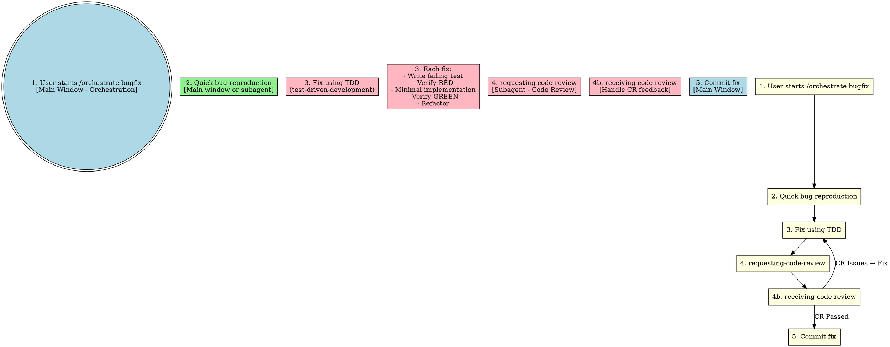
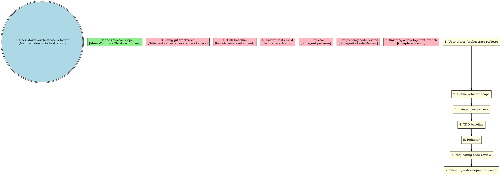

# Orchestrate Skill

Unified workflow orchestration entry point. All implementation happens in subagents. Main window handles orchestration and user interaction only.

**Core principle:** One entry point, all execution in subagents.

## Entry Points

```
/orchestrate feature "<description>"  - Feature development workflow
/orchestrate bugfix "<description>"   - Bug fix workflow
/orchestrate refactor "<description>" - Refactoring workflow
```

## Complete Feature Workflow

```dot
digraph orchestrate_feature_workflow_v2 {
    rankdir=TB;
    node [shape=box style=filled fillcolor=lightyellow];

    "1. User starts /orchestrate feature" [shape=doublecircle fillcolor=lightblue];

    "2. brainstorming skill\n[Main Window]" [fillcolor=lightgreen];
    "3. Output: docs/nbl/specs/\n<date>-<topic>-design.md" [shape=note fillcolor=lightgray];
    "3b. Spec Review Loop\n(spec-document-reviewer)" [fillcolor=lightpink];

    "4. writing-plans skill\n(with task dependencies)" [fillcolor=lightgreen];
    "5. Output: docs/nbl/plans/\n<date>-<feature>.md" [shape=note fillcolor=lightgray];
    "5b. Plan Review Loop\n(plan-document-reviewer)" [fillcolor=lightpink];

    "6. Build dependency graph" [fillcolor=lightgreen];
    "7. Identify parallel levels" [shape=diamond fillcolor=lightyellow];

    "8a. Sequential level\n(single task)" [fillcolor=lightyellow];
    "8b. Parallel level\n(multiple tasks, max 5)" [fillcolor=lightyellow];

    "9a. Single worktree\n(using-git-worktrees)" [fillcolor=lightpink];
    "9b. Batch worktrees\n(using-git-worktrees)" [fillcolor=lightpink];

    "10a. Sequential execution\n(subagent-driven-development)" [fillcolor=lightpink];
    "10b. Parallel execution:\n- Dispatch agents (max 5)\n- Wait & process completions\n- CR → Rebase → Merge\n- Cleanup worktree" [fillcolor=lightpink];

    "11. More levels?" [shape=diamond fillcolor=lightyellow];
    "12. requesting-code-review" [fillcolor=lightpink];
    "13. finishing-a-development-branch" [fillcolor=lightpink];
    "14. Return to main window" [shape=doublecircle fillcolor=lightblue];

    "1. User starts /orchestrate feature" -> "2. brainstorming skill\n[Main Window]";
    "2. brainstorming skill\n[Main Window]" -> "3. Output: docs/nbl/specs/\n<date>-<topic>-design.md";
    "3. Output: docs/nbl/specs/\n<date>-<topic>-design.md" -> "3b. Spec Review Loop\n(spec-document-reviewer)";
    "3b. Spec Review Loop\n(spec-document-reviewer)" -> "4. writing-plans skill\n(with task dependencies)" [label="approved"];

    "4. writing-plans skill\n(with task dependencies)" -> "5. Output: docs/nbl/plans/\n<date>-<feature>.md";
    "5. Output: docs/nbl/plans/\n<date>-<feature>.md" -> "5b. Plan Review Loop\n(plan-document-reviewer)";
    "5b. Plan Review Loop\n(plan-document-reviewer)" -> "6. Build dependency graph" [label="approved"];

    "6. Build dependency graph" -> "7. Identify parallel levels";
    "7. Identify parallel levels" -> "8a. Sequential level\n(single task)" [label="single task"];
    "7. Identify parallel levels" -> "8b. Parallel level\n(multiple tasks, max 5)" [label="multiple tasks"];

    "8a. Sequential level\n(single task)" -> "9a. Single worktree\n(using-git-worktrees)";
    "9a. Single worktree\n(using-git-worktrees)" -> "10a. Sequential execution\n(subagent-driven-development)";

    "8b. Parallel level\n(multiple tasks, max 5)" -> "9b. Batch worktrees\n(using-git-worktrees)";
    "9b. Batch worktrees\n(using-git-worktrees)" -> "10b. Parallel execution:\n- Dispatch agents (max 5)\n- Wait & process completions\n- CR → Rebase → Merge\n- Cleanup worktree";

    "10a. Sequential execution\n(subagent-driven-development)" -> "11. More levels?";
    "10b. Parallel execution:\n- Dispatch agents (max 5)\n- Wait & process completions\n- CR → Rebase → Merge\n- Cleanup worktree" -> "11. More levels?";

    "11. More levels?" -> "7. Identify parallel levels" [label="yes"];
    "11. More levels?" -> "12. requesting-code-review" [label="no"];

    "12. requesting-code-review" -> "13. finishing-a-development-branch";
    "13. finishing-a-development-branch" -> "14. Return to main window";
}
```



## Bugfix Workflow



## Refactor Workflow



## Skill Dependencies

| Skill | Execution | Purpose |
|-------|-----------|---------|
| **orchestrate** | Main window | Unified entry point |
| **brainstorming** | Main window | Requirements clarification |
| **writing-plans** | Subagent | Detailed plan with task dependencies |
| **plan** | Subagent | Lightweight plan for small requirements |
| **using-git-worktrees** | Subagent | Isolated workspace (single or batch mode) |
| **subagent-driven-development** | Subagent | Task execution (sequential or parallel, max 5) |
| **test-driven-development** | Subagent | TDD cycle |
| **dispatching-parallel-agents** | Subagent | Parallel task execution (deprecated, use subagent-driven-development) |
| **requesting-code-review** | Subagent | Code review |
| **receiving-code-review** | Subagent | Handle CR feedback |
| **finishing-a-development-branch** | Subagent | Complete branch |

## When to Use

| Scenario | Workflow | Plan Type |
|----------|----------|-----------|
| New feature (complex) | feature | writing-plans → file output |
| New feature (simple) | feature | plan → in-memory |
| Bug fix | bugfix | TDD → subagent |
| Safe refactoring | refactor | TDD baseline → subagent |
| Multi-subsystem project | feature (decomposed) | Separate plan per subsystem |

## Decision Logic

```
Is this a creative/implementation task?
  └── YES → Use brainstorming first (main window)
       └── After brainstorming:
            ├── Large requirement? → writing-plans (with task dependencies)
            └── Small requirement? → plan (in-memory)
       └── After plan:
            ├── Build dependency graph from task dependencies
            ├── Identify parallel levels
            └── For each level:
                 ├── Single task? → Sequential execution (single worktree)
                 └── Multiple tasks? → Parallel execution (max 5 worktrees)
  └── NO (simple/known) → Skip brainstorming
       └── Direct to appropriate workflow

Parallel execution (max 5 agents):
  ├── Create batch worktrees
  ├── Dispatch agents simultaneously
  ├── Process completions: CR → Rebase → Merge → Cleanup
  └── Handle conflicts at rebase time
```

## Subagent Templates

See `subagent-templates.md` for subagent dispatch templates.

## Red Flags

**Never:**
- Implement in main window (all work in subagents)
- Skip brainstorming for creative tasks
- Skip TDD for bug fixes
- Skip code review
- Skip CR feedback handling

**Always:**
- Use orchestrate as single entry point
- Dispatch subagents for all implementation
- Handle CR feedback before proceeding
