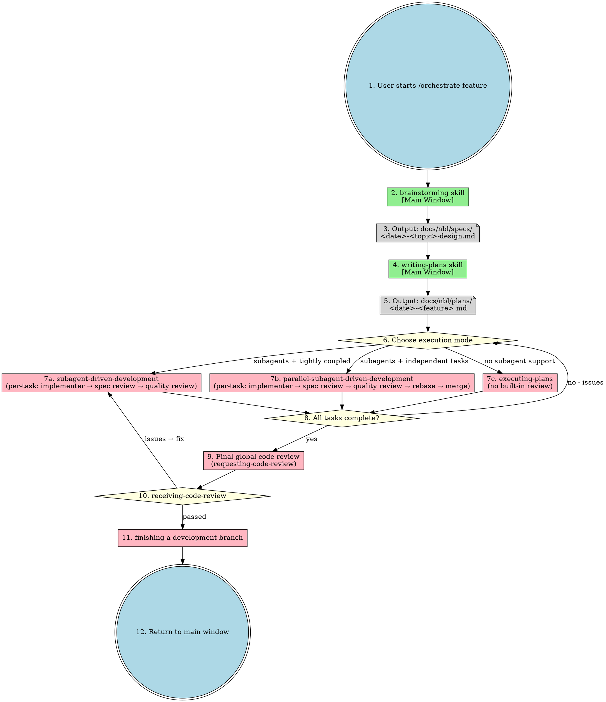
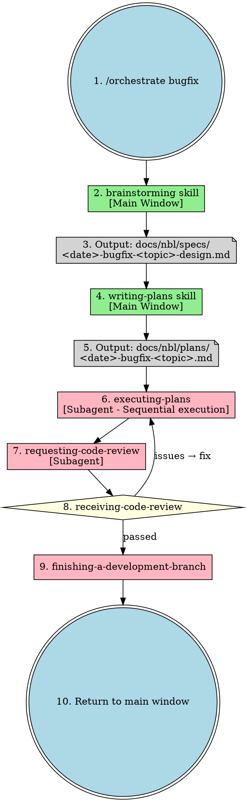

# Orchestrate Skill

Unified workflow orchestration entry point. All implementation happens in subagents. Main window handles orchestration and user interaction only.

**Core principle:** One entry point, all execution in subagents.

## Entry Points

```
/orchestrate feature "<description>"  - Feature development workflow
/orchestrate bugfix "<description>"   - Bug fix workflow
```

## Complete Feature Workflow



### Code Review 出现在两个层级

| 层级 | 时机 | 内容 | 处理方式 |
|------|------|------|---------|
| **任务级**（内置在 7a/7b 中） | 每个任务完成后 | Stage 1: Spec Review → Stage 2: Quality Review | 实现子代理修复 → 重新审查 → 循环直到通过 |
| **全局级**（步骤 9-10） | 所有任务完成后 | 整体代码审查 | receiving-code-review 处理反馈 → 有问题则返回修复 → 通过则继续 |

**注意：** executing-plans（7c）没有内置任务级审查，因此全局审查（步骤 9）是其唯一的代码质量保障。

## Bugfix Workflow



## Skill Dependencies

| Skill | Execution | Purpose |
|-------|-----------|---------|
| **orchestrate** | Main window | Unified entry point |
| **brainstorming** | Main window | Requirements clarification |
| **writing-plans** | Main window | Detailed plan with task dependencies |
| **using-git-worktrees** | Subagent | Isolated workspace (single or batch mode) |
| **subagent-driven-development** | Subagent | Sequential task execution in same session |
| **parallel-subagent-driven-development** | Subagent | Parallel task execution (max 5) in same session |
| **executing-plans** | Parallel session | Sequential execution without subagent support |
| **test-driven-development** | Subagent | TDD cycle |
| **requesting-code-review** | Subagent | Code review |
| **receiving-code-review** | Subagent | Handle CR feedback |
| **finishing-a-development-branch** | Subagent | Complete branch |

## When to Use

| Scenario | Workflow | Execution Mode |
|----------|----------|----------------|
| New feature (complex) | feature | writing-plans → parallel-subagent-driven-development |
| New feature (simple) | feature | writing-plans → subagent-driven-development |
| Bug fix | bugfix | brainstorming → writing-plans → executing-plans |
| Multi-subsystem project | feature (decomposed) | Separate plan per subsystem |
| No subagent support | any | executing-plans |

## Decision Logic

```
All tasks follow the same flow:
  1. brainstorming (main window) → design.md
  2. writing-plans (main window) → plan.md
  3. Choose execution mode (see Complete Feature Workflow diagram)
```

## Red Flags

**Never:**
- Skip brainstorming
- Skip code review
- Skip CR feedback handling
- Start implementation on main/master branch without worktree isolation

**Always:**
- Use orchestrate as single entry point
- Dispatch subagents for all implementation
- Handle CR feedback before proceeding
- Use worktree isolation before implementation
