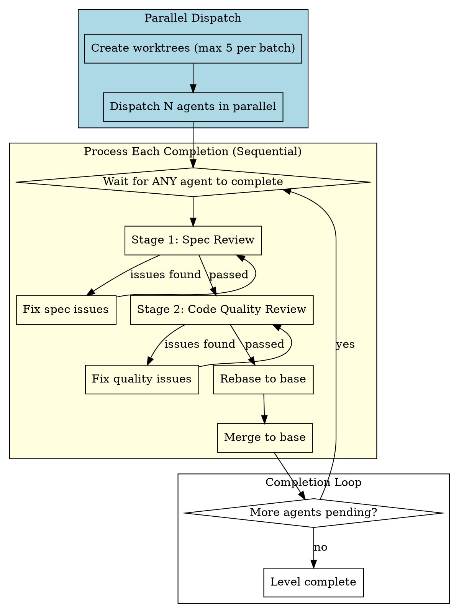

# Parallel Subagent-Driven Development

Execute plan by dispatching fresh subagent per task, with two-stage review after each: spec compliance review first, then code quality review.

**Why subagents:** You delegate tasks to specialized agents with isolated context. By precisely crafting their instructions and context, you ensure they stay focused and succeed at their task. They should never inherit your session's context or history — you construct exactly what they need. This also preserves your own context for coordination work.

**Core principle:** Fresh subagent per task + two-stage review (spec then quality) = high quality, fast iteration

**Parallel execution:** Analyzes task dependencies, groups tasks by level, and executes independent tasks in parallel within each level.

## ⛔ STOP: Read Before ANY Action

```
┌─────────────────────────────────────────────────────────────────┐
│  BEFORE reading plan, BEFORE creating tasks, BEFORE anything:   │
│                                                                 │
│  1. Are you on main/master branch? → MUST call worktree skill   │
│  2. Already in a worktree? → Skip to "Read Plan" section        │
│                                                                 │
│  NEVER dispatch implementer on main/master without worktree     │
└─────────────────────────────────────────────────────────────────┘
```

## NON-NEGOTIABLE Requirements (Read BEFORE Starting)

**You MUST complete these checks before dispatching ANY implementer subagent:**

<NON_NEGOTIABLE>

### 1. Worktree Setup (MANDATORY)

```
Before each level:
├── Isolated workspace? → Call nbl.using-git-worktrees
│   ├── Single task in level → Single worktree
│   └── Multiple tasks in level → Batch worktrees (max 5)
└── Verify: git worktree list shows your worktree(s)
```

**Never:** Dispatch implementer on main/master branch without worktree isolation

### 2. TDD Required (MANDATORY)

```
Every implementation task MUST:
├── Invoke nbl.test-driven-development skill FIRST
├── Skill guides RED→GREEN→REFACTOR cycle
└── Never write implementation before tests
```

**Never:** Skip TDD skill, write implementation before tests

### 3. Two-Stage Review (MANDATORY)

```
After implementer completes:
├── Stage 1: Spec compliance review
│   ├── Invoke nbl.requesting-code-review skill
│   ├── Use spec-reviewer-prompt.md template
│   ├── ❌ Issues? → Implementer fixes → Re-review
│   └── ✅ Pass → Proceed to Stage 2
├── Stage 2: Code quality review
│   ├── Invoke nbl.requesting-code-review skill
│   ├── Use code-quality-reviewer-prompt.md template
│   ├── ❌ Issues? → Implementer fixes → Re-review
│   └── ✅ Pass → Task complete
└── Never skip either stage
```

**Never:**
- Let implementer self-review replace actual review
- Skip spec compliance review
- Skip code quality review
- Proceed to next task with open review issues

</NON_NEGOTIABLE>

## Level-Based Execution

### Dependency Graph Analysis

```python
# Pseudocode
def analyze_plan(plan):
    for task in plan.tasks:
        if task.dependencies == None:
            task.level = 0
        else:
            task.level = max(dep.level for dep in task.dependencies) + 1

    levels = group_by_level(tasks)
    return levels
```

### Level Semantics

```
Level 0: Task 1, Task 3      # No dependencies
        ↓
Level 1: Task 2, Task 4      # Depends on Level 0
        ↓
Level 2: ...                  # Depends on Level 1
```

**Key insight:** Level describes **dependency constraints**. All tasks in a level must complete before Level+1 starts.

### Pipeline Execution Pattern

```
For each level:
    ├── Create worktrees for tasks in this level (max 5 per batch)
    ├── Dispatch agents in parallel
    ├── Process each completion (spec review → quality review → rebase → merge)
    ├── Wait all tasks in level complete (ALL steps)
    └── Proceed to next level
```

### Level Completion Criteria

**All tasks must complete ALL steps before next level:**

| Step | Description | Must Pass? |
|------|-------------|------------|
| 1 | Implementer reports DONE | ✅ |
| 2 | Spec compliance review | ✅ |
| 3 | Code quality review | ✅ |
| 4 | Rebase to base | ✅ |
| 5 | Merge to base | ✅ |
| 6 | Mark task complete in plan file (change `-[ ]` to `-[X]`) | ✅ |

**Key rule:** Level completion = ALL tasks passed ALL steps.

### Failure Handling

If any task fails at any step:
1. **Level is blocked** — do NOT proceed to next level
2. **Fix the failing task** — implementer fixes, re-review
3. **Resume once all tasks pass** — then proceed to next level

## Pipeline Execution

This section documents the detailed flow for multi-task levels. See "The Process" diagram above for the unified view.

### Pipeline Flow



### Per-Task Rebase + Merge Process

For each completed agent:

1. **Stage 1: Spec Review** - Verify implementation matches spec
2. **Stage 2: Code Quality Review** - Verify code quality
3. **Fix Issues** - If either stage fails, implementer fixes and re-reviews
4. **Rebase** (in task worktree, on task branch) - `git rebase $base_branch` (handle conflicts if any)
   - `$base_branch` is the branch we created worktrees from (e.g., main, dev, master)
5. **Merge** (in main workspace, on base branch) - `git checkout $base_branch && git merge --ff-only $task_branch`
   - `$task_branch` is the branch for this task (e.g., `feature/{base_name}-task{task_id}`)
6. **Cleanup worktree** - Remove the task worktree immediately (non-blocking)
   ```bash
   # Cleanup worktree - failure does not block the pipeline
   if [ -d "$worktree_path" ]; then
       if git worktree remove --force "$worktree_path" 2>/dev/null; then
           echo "✅ Worktree cleaned: $worktree_path"
       else
           echo "⚠️ Warning: Failed to remove worktree $worktree_path - skipping, manual cleanup may be needed"
       fi
   fi
   ```
7. **Keep branch** - Branch deletion is handled by `finishing-a-development-branch` after all tasks complete

### Error Handling

| Scenario | Action |
|----------|--------|
| Spec review fails | Implementer fixes spec gaps, re-review |
| Code quality review fails | Implementer fixes quality issues, re-review |
| Agent blocked | Main agent provides context or re-dispatches |
| Rebase conflict | Follow "Rebase Conflict Resolution" section below |
| Merge fails | Rollback, fix, retry |
| **Any task in level fails** | **Whole level blocked — do NOT proceed to next level** |

**Rule:** One agent failure does not block other parallel agents from executing, but blocks that agent's subsequent merges until fixed. Any failure at the level level blocks the entire level from completing.

## Rebase Conflict Resolution

When `git rebase $base_branch` encounters conflicts, use the following process:

### Why LLM for Conflicts?

Large language models excel at resolving Git conflicts because they understand semantics:
- Can analyze what changed in base vs what the subagent changed
- Can intelligently merge non-conflicting parts
- Can resolve most simple conflicts automatically (70-80%)
- Only complex semantic conflicts require human judgment

### Resolution Flow

```
1. git rebase $base_branch
2. If conflict:
   a. Get conflict status: git status
   b. Get conflict details: git diff (shows base vs subagent changes)
   c. LLM analyzes → generates merged code
   d. Write merged files
   e. git add <conflict-files>
   f. git rebase --continue
3. If auto-resolution succeeds → continue normal flow
```

### Escalation: When Auto-Resolution Fails

If the conflict is too complex for automatic resolution:

1. `git rebase --abort` — rollback to state before rebase attempt
2. Present conflict details to user
3. Explain why automatic resolution failed
4. User makes decision:
   - Manually resolve themselves
   - Provide additional context for retry
   - Other approach

### Key Principle

**Main agent coordinates; user decides on complex conflicts; LLM executes.**

| Conflict Type | Action |
|--------------|--------|
| Simple (localized, obvious merge) | LLM auto-resolve |
| Complex (semantic ambiguity) | Escalate to user |

## The Process (WITH NON-NEGOTIABLE GATES)

```dot
digraph process {
    rankdir=TB;

    subgraph cluster_pre_execution {
        label="Pre-Execution Gate (MANDATORY)";
        style=filled fillcolor=lightcoral];
        "⛔ GATE 1: Run git worktree list" [shape=box style=filled fillcolor=yellow];
        "Current dir in worktree?" [shape=diamond style=filled fillcolor=yellow];
        "Invoke nbl.using-git-worktrees" [shape=box style=filled fillcolor=lightpink];
        "cd to worktree directory" [shape=box];
    }

    subgraph cluster_setup {
        label="Setup Phase";
        style=filled fillcolor=lightyellow;
        "Read plan, extract all tasks with full text, note context, create TodoWrite" [shape=box];
        "Analyze dependencies → Build levels" [shape=box];
    }

    subgraph cluster_level_loop {
        label="For Each Level (Sequential)";
        style=filled fillcolor=lightyellow;
        "Create worktrees for tasks in this level (max 5)" [shape=box style=filled fillcolor=lightpink];
        "Dispatch N agents in parallel" [shape=box style=filled fillcolor=lightblue];
    }

    // Pre-execution flow
    "⛔ GATE 1: Run git worktree list" -> "Current dir in worktree?";
    "Current dir in worktree?" -> "cd to worktree directory" [label="yes"];
    "Current dir in worktree?" -> "Invoke nbl.using-git-worktrees" [label="no"];
    "Invoke nbl.using-git-worktrees" -> "⛔ GATE 1: Run git worktree list" [label="verify"];
    "cd to worktree directory" -> "Read plan, extract all tasks with full text, note context, create TodoWrite";

    subgraph cluster_pipeline {
        label="Pipeline Processing";
        style=filled fillcolor=lightblue;
        "Wait for ANY completion" [shape=diamond];
        "Stage 1: Spec Review" [shape=diamond];
        "Fix spec issues" [shape=box];
        "Stage 2: Code Quality Review" [shape=diamond];
        "Fix quality issues" [shape=box];
        "Rebase to base" [shape=box];
        "Merge to base" [shape=box];
        "More agents pending?" [shape=diamond];
        "Level complete" [shape=box];
    }

    subgraph cluster_cleanup {
        label="After Level Complete";
        "Mark level tasks complete (TodoWrite + Plan file)" [shape=box];
        "More levels?" [shape=diamond];
    }

    subgraph cluster_finish {
        label="All Levels Complete";
        "Dispatch final code reviewer" [shape=box];
        "Use nbl.finishing-a-development-branch" [shape=doublecircle style=filled fillcolor=lightgreen];
    }

    // Setup flow
    "Read plan, extract all tasks with full text, note context, create TodoWrite" -> "Analyze dependencies → Build levels";
    "Analyze dependencies → Build levels" -> "Create worktrees for tasks in this level (max 5)";
    "Create worktrees for tasks in this level (max 5)" -> "Dispatch N agents in parallel";

    // Pipeline processing
    "Dispatch N agents in parallel" -> "Wait for ANY completion";
    "Wait for ANY completion" -> "Stage 1: Spec Review";
    "Stage 1: Spec Review" -> "Fix spec issues" [label="issues found"];
    "Fix spec issues" -> "Stage 1: Spec Review";
    "Stage 1: Spec Review" -> "Stage 2: Code Quality Review" [label="passed"];
    "Stage 2: Code Quality Review" -> "Fix quality issues" [label="issues found"];
    "Fix quality issues" -> "Stage 2: Code Quality Review";
    "Stage 2: Code Quality Review" -> "Rebase to base" [label="passed"];
    "Rebase to base" -> "Merge to base";
    "Merge to base" -> "More agents pending?";
    "More agents pending?" -> "Wait for ANY completion" [label="yes - continue"];
    "More agents pending?" -> "Level complete" [label="no"];

    // Cleanup flow
    "Level complete" -> "Mark level tasks complete (TodoWrite + Plan file)";
    "Mark level tasks complete (TodoWrite + Plan file)" -> "More levels?";
    "More levels?" -> "Create worktrees for tasks in this level (max 5)" [label="yes - next level"];
    "More levels?" -> "Dispatch final code reviewer" [label="no"];
    "Dispatch final code reviewer" -> "Use nbl.finishing-a-development-branch";
}
```

### Batch Handling for 6+ Tasks

| Tasks in Level | Approach |
|----------------|----------|
| **2-5 tasks** | Single batch, all agents in parallel |
| **6+ tasks** | Split into batches of 5, process batch by batch |

### Process Gates Summary

| Gate | Location | Requirement |
|------|----------|-------------|
| **GATE 1: Worktree** | BEFORE reading plan | MUST verify current dir is in worktree (run `git worktree list`) |
| **GATE 2: TDD** | Implementer phase | MUST invoke `nbl.test-driven-development` skill |
| **GATE 3: Spec Review** | After implementer | MUST invoke `nbl.requesting-code-review` with spec-reviewer template |
| **GATE 4: Quality Review** | After spec review | MUST invoke `nbl.requesting-code-review` with code-quality template |

## Model Selection

Use the least powerful model that can handle each role to conserve cost and increase speed.

**Mechanical implementation tasks** (isolated functions, clear specs, 1-2 files): use a fast, cheap model. Most implementation tasks are mechanical when the plan is well-specified.

**Integration and judgment tasks** (multi-file coordination, pattern matching, debugging): use a standard model.

**Architecture, design, and review tasks**: use the most capable available model.

**Task complexity signals:**
- Touches 1-2 files with a complete spec → cheap model
- Touches multiple files with integration concerns → standard model
- Requires design judgment or broad codebase understanding → most capable model

## Handling Implementer Status

Implementer subagents report one of four statuses. Handle each appropriately:

**DONE:** Proceed to spec compliance review.

**DONE_WITH_CONCERNS:** The implementer completed the work but flagged doubts. Read the concerns before proceeding. If the concerns are about correctness or scope, address them before review. If they're observations (e.g., "this file is getting large"), note them and proceed to review.

**NEEDS_CONTEXT:** The implementer needs information that wasn't provided. Provide the missing context and re-dispatch.

**BLOCKED:** The implementer cannot complete the task. Assess the blocker:
1. If it's a context problem, provide more context and re-dispatch with the same model
2. If the task requires more reasoning, re-dispatch with a more capable model
3. If the task is too large, break it into smaller pieces
4. If the plan itself is wrong, escalate to the human

**Never** ignore an escalation or force the same model to retry without changes. If the implementer said it's stuck, something needs to change.

## Prompt Templates

Prompt templates are shared with serial subagent-driven-development:
- `../nbl.subagent-driven-development/implementer-prompt.md` - Dispatch implementer subagent
- `../nbl.subagent-driven-development/spec-reviewer-prompt.md` - Dispatch spec compliance reviewer subagent
- `../nbl.subagent-driven-development/code-quality-reviewer-prompt.md` - Dispatch code quality reviewer subagent

## Advantages

**vs. Manual execution:**
- Subagents follow TDD naturally
- Fresh context per task (no confusion)
- Parallel-safe (subagents don't interfere)
- Subagent can ask questions (before AND during work)

**vs. Executing Plans (main agent):**
- Subagents execute (isolated context)
- Continuous progress (no waiting)
- Review checkpoints automatic

**Efficiency gains:**
- No file reading overhead (controller provides full text)
- Controller curates exactly what context is needed
- Subagent gets complete information upfront
- Questions surfaced before work begins (not after)
- Parallel tasks complete faster

**Quality gates:**
- Self-review catches issues before handoff
- Two-stage review: spec compliance, then code quality
- Review loops ensure fixes actually work
- Spec compliance prevents over/under-building
- Code quality ensures implementation is well-built

**Cost:**
- More subagent invocations (implementer + 2 reviewers per task)
- Controller does more prep work (extracting all tasks upfront)
- Review loops add iterations
- But catches issues early (cheaper than debugging later)

## Red Flags

**Never:**
- Dispatch an implementer without worktree isolation (MUST call `nbl.using-git-worktrees` first, always required regardless of current branch)
- Skip reviews (spec compliance OR code quality)
- Proceed with unfixed issues
- Make subagent read plan file (provide full text instead)
- Skip scene-setting context (subagent needs to understand where task fits)
- Ignore subagent questions (answer before letting them proceed)
- Accept "close enough" on spec compliance (spec reviewer found issues = not done)
- Skip review loops (reviewer found issues = implementer fixes = review again)
- Let implementer self-review replace actual review (both are needed)
- **Start code quality review before spec compliance is ✅** (wrong order)
- Move to next task while either review has open issues
- Dispatch more than 5 agents simultaneously
- Skip CR before merge
- Merge without rebasing first
- Proceed to next level with failed agents
- Ignore rebase conflicts

**If subagent asks questions:**
- Answer clearly and completely
- Provide additional context if needed
- Don't rush them into implementation
- **Parallel mode:** One question at a time to the user - other agents keep running while waiting

**If reviewer finds issues:**
- Implementer (same subagent) fixes them
- Reviewer reviews again
- Repeat until approved
- Don't skip the re-review

**If subagent fails task:**
- Dispatch fix subagent with specific instructions
- Don't try to fix manually (context pollution)

## Integration

**Required workflow skills:**
- **nbl.using-git-worktrees** - REQUIRED: Set up isolated worktrees before each level
- **nbl.writing-plans** - Creates the plan this skill executes (with task dependencies)
- **nbl.requesting-code-review** - Code review template for reviewer subagents
- **nbl.finishing-a-development-branch** - Complete development after all tasks are merged

**Subagents should use:**
- **nbl.test-driven-development** - Subagents follow TDD for each task
