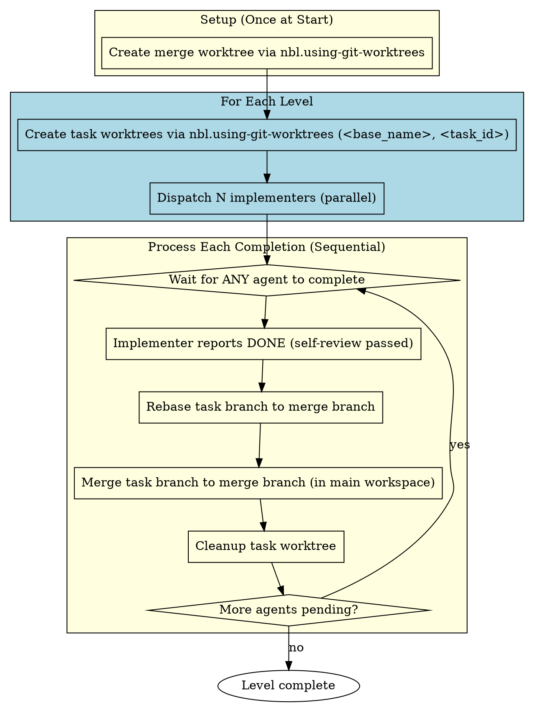

# Parallel Subagent-Driven Development

Execute plan by dispatching fresh subagent per task. Each implementer performs built-in two-stage self-review (spec compliance + code quality) before reporting done. After all tasks complete in all levels, perform global two-stage review on all merged code.

**Why subagents:** You delegate tasks to specialized agents with isolated context. By precisely crafting their instructions and context, you ensure they stay focused and succeed at their task. They should never inherit your session's context or history — you construct exactly what they need. This also preserves your own context for coordination work.

**Core principle:** Fresh subagent per task with built-in two-stage self-review + global review after all tasks = high quality, fast iteration

**Parallel execution:** Analyzes task dependencies, groups tasks by level, and executes independent tasks in parallel within each level.

**Key difference from previous design:** Parallel mode creates a top-level merge worktree at startup from the base development branch. All tasks in each level fork from this merge worktree and merge back to it after completion. After all tasks complete, only the merge worktree remains with all accumulated changes, and the original finishing-a-development-branch skill can be used.

## ⛔ Pre-Check: Git Repository Validation

**This skill requires a Git repository.** Before any action:
1. Check if current directory is a Git repository (`git rev-parse --is-inside-work-tree`)
2. If **NOT** a Git repository → **STOP immediately** and tell the user:
   > "Error: nbl.parallel-subagent-driven-development requires a Git repository. Please run `git init` to initialize a repository, then retry."
3. If it IS a Git repository → continue to next steps

## NON-NEGOTIABLE Requirements (Read BEFORE Starting)

**You MUST complete these checks before dispatching ANY implementer subagent:**

<NON_NEGOTIABLE>

**CRITICAL RULE:**
> **If you are in the primary working tree (`.git` is a directory)**, regardless of whether you are on `main`/`master` or already on a development branch, you **MUST** invoke `nbl.using-git-worktrees` to create an isolated merge worktree before processing any tasks. **NO EXCEPTIONS.**
>
> Primary working tree is for branch management only. ALL tasks run in isolated worktrees. Never implement directly in primary worktree.

</NON_NEGOTIABLE>

### 1. Worktree Setup (MANDATORY)

**Typical Usage Pattern (our convention):**
> User ALWAYS starts Claude Code in the **main working tree** (primary worktree). The skill creates the isolated merge worktree, user doesn't manually cd into worktrees to start Claude Code.

**FULL Check Process (execute step-by-step, NO shortcuts):**

```
STEP 1: Pre-check - Is this a Git repository?
  Execute: git rev-parse --is-inside-work-tree
  If NO → STOP, prompt user to initialize Git
  If YES → continue to STEP 2

STEP 2: Check if already inside an added worktree:
  If .git is a file → INSIDE_ADDED_WORKTREE = YES
  If .git is a directory → INSIDE_ADDED_WORKTREE = NO

STEP 3: If INSIDE_ADDED_WORKTREE = YES:
  → Proceed directly to create merge worktree from current branch

STEP 4: If INSIDE_ADDED_WORKTREE = NO (in primary working tree):
  Get current branch: CURRENT_BRANCH=$(git rev-parse --abbrev-ref HEAD

  If CURRENT_BRANCH is "main" or "master":
    1. Auto-create development branch from plan name
    2. Checkout new development branch in primary working tree

  // CRITICAL: This step executes for BOTH main/master AND development branches!
  INVOKE: `/nbl.superpowers:nbl.using-git-worktrees create <base-name-merge>
  // After invocation, you will be inside the newly created merge worktree
  → Setup complete, proceed to read plan and analyze dependencies
```

**Result after setup:**
```
- Base name: `<name>-merge`
- Branch: `feature/{name}-merge`
- Path: `.worktrees/{name}-merge/`
- All subsequent task worktrees will be created from this merge worktree
```

**Key difference from previous design:**
- Create ONE top-level merge worktree at startup from the development branch
- Each task in each level creates its own isolated worktree from merge worktree
- After each task completes, it's merged back to merge worktree and the task worktree is cleaned up
- No top-level worktree needed before starting - only the merge worktree

**Never:** Dispatch implementer on main/master branch without worktree isolation
**Never:** Create worktree with direct `git worktree add` - always use **nbl.using-git-worktrees** skill to create worktrees (skill handles correct path calculation)
**MUST:** complete setup before any task dispatching, NO exceptions

### 2. TDD Required (MANDATORY)

```
Every implementation task MUST:
├── Invoke nbl.test-driven-development skill FIRST
├── Skill guides RED→GREEN→REFACTOR cycle
└── Never write implementation before tests
```

**Never:** Skip TDD skill, write implementation before tests

### 3. Built-In Two-Stage Self-Review (MANDATORY)

```
Each implementer MUST complete this before reporting DONE:
├── Stage 1: Spec compliance self-review
│   ├── Check all requirements line-by-line
│   ├── ❌ Issues? → Implementer fixes immediately
│   └── ✅ Pass → Proceed to Stage 2
├── Stage 2: Code quality self-review
│   ├── Check code quality, naming, conventions
│   ├── ❌ Issues? → Implementer fixes immediately
│   └── ✅ Pass → Report DONE
└── Never report DONE until both stages pass with NO issues
```

**Never:**
- Skip either stage of self-review
- Report DONE with unfixed issues
- Proceed to merge with open issues

**This is NON-NEGOTIABLE.** Each task must pass both stages of self-review before it can be merged.

### 4. Merge Worktree Lifecycle (MANDATORY)

```
- One merge worktree is created at startup from development branch
- ALL task merges go to the merge worktree's merge branch
- The merge worktree MUST remain intact until ALL levels complete
- After all levels complete, nbl.finishing-a-development-branch handles final merge to development branch and cleanup
```

**Never:** Delete the merge worktree before all levels complete. This breaks the entire flow.

### 5. Directory Safety (MANDATORY)

```
- After any 'cd' into a worktree, always 'cd' back to project root before next command
- Prefer using the shared sub-to-sub-merge script for complete merge + cleanup in one step
- Never leave the current working directory inside a worktree between Bash commands
```

Bash tool preserves working directory between invocations. Getting lost in nested directories breaks all relative path lookups.

</NON_NEGOTIABLE>

## Level-Based Execution

### Dependency Graph Analysis

```python
# Pseudocode
def analyze_plan(plan):
    for task in plan.tasks:
        if task.dependencies == None:
            task.level = 0
        else:
            task.level = max(dep.level for dep in task.dependencies) + 1

    levels = group_by_level(tasks)
    return levels
```

### Level Semantics

```
Level 0: Task 1, Task 3      # No dependencies
        ↓
Level 1: Task 2, Task 4      # Depends on Level 0
        ↓
Level 2: ...                  # Depends on Level 1
```

**Key insight:** Level describes **dependency constraints**. All tasks in a level must complete before Level+1 starts.

### Pipeline Execution Pattern

```
For each level:
    ├── Create worktrees for tasks in this level (max 5 per batch)
    │   For each task, invoke **nbl.using-git-worktrees** skill with:
    │   - Base name: `<base_name>`
    │   - Task id: `<task_id>`
    │   Skill handles correct path calculation automatically: `.worktrees/{base}-task{id}`
    ├── Dispatch agents in parallel
    ├── Wait all tasks complete (implementer does built-in two-stage self-review)
    ├── Rebase each task branch to merge branch
    ├── Merge all task branches to merge branch
    ├── Mark all completed tasks as done in TodoWrite and plan file
    └── Proceed to next level
```

### Level Completion Criteria

**All tasks must complete ALL steps before next level:**

| Step | Description | Must Pass? |
|------|-------------|------------|
| 1 | Implementer reports DONE (with built-in self-review passed) | ✅ |
| 2 | Rebase to merge branch | ✅ |
| 3 | Merge to merge branch | ✅ |
| 4 | Mark task statuses complete in plan file | ✅ |

**Key rule:** Level completion = ALL tasks passed ALL steps.

### Failure Handling

If any task fails at any step:
1. **Level is blocked** — do NOT proceed to next level
2. **Fix the failing task** — implementer fixes, re-review if needed
3. **Resume once all tasks pass** — then proceed to next level

## Pipeline Execution

This section documents the detailed flow for multi-task levels. See "The Process" diagram above for the unified view.

### Pipeline Flow (New Design)



### Per-Task Rebase + Merge Process (in merge worktree model)

For each completed agent:

1. **Implementer completes:** implement → spec self-check → fix → quality self-check → fix → DONE
2. **Rebase + Merge + Cleanup** - Invoke `nbl.using-git-worktrees` skill:
   ```
   /nbl.superpowers:nbl.using-git-worktrees merge-sub <base_name> <task_id>
   ```
   > ⚠️ **NON-NEGOTIABLE**: The merge **must** happen inside the merge worktree. The merge branch is already checked out there — do NOT attempt `git checkout $merge_branch` in the main workspace (Git forbids checking out the same branch in two worktrees simultaneously).

3. **Keep branch** - Branch deletion is handled by `finishing-a-development-branch` after all tasks complete

### Failure Handling

| Scenario | Action |
|----------|--------|
| Implementer cannot complete (BLOCKED/NEEDS_CONTEXT) | Main agent provides context or re-dispatch |
| Rebase conflict | Follow "Rebase Conflict Resolution" section below |
| Merge fails | Rollback, fix, retry |
| **Any task in level fails** | **Whole level blocked — do NOT proceed to next level** |

**Rule:** One agent failure does not block other parallel agents from executing, but blocks that agent's subsequent merges until fixed. Any failure at the level level blocks the entire level from completing.

## Rebase Conflict Resolution

When `git rebase $merge_branch` encounters conflicts, use the following process:

### Why LLM for Conflicts?

Large language models excel at resolving Git conflicts because they understand semantics:
- Can analyze what changed in base vs what the subagent changed
- Can intelligently merge non-conflicting parts
- Can resolve most simple conflicts automatically (70-80%)
- Only complex semantic conflicts require human judgment

### Resolution Flow

```
1. git rebase $base_branch
2. If conflict:
   a. Get conflict status: git status
   b. Get conflict details: git diff (shows base vs subagent changes)
   c. LLM analyzes → generates merged code
   d. Write merged files
   e. git add <conflict-files>
   f. git rebase --continue
3. If auto-resolution succeeds → continue normal flow
```

### Escalation: When Auto-Resolution Fails

If the conflict is too complex for automatic resolution:

1. `git rebase --abort` — rollback to state before rebase attempt
2. Present conflict details to user
3. Explain why automatic resolution failed
4. User makes decision:
   - Manually resolve themselves
   - Provide additional context for retry
   - Other approach

### Key Principle

**Main agent coordinates; user decides on complex conflicts; LLM executes.**

| Conflict Type | Action |
|--------------|--------|
| Simple (localized, obvious merge) | LLM auto-resolve |
| Complex (semantic ambiguity) | Escalate to user |

## The Process (WITH NON-NEGOTIABLE GATES)

```dot
digraph process {
    rankdir=TB;

    subgraph cluster_setup {
        label="Setup Phase";
        style=filled fillcolor=lightyellow;
        "Pre-Check: Is git repository?" [shape=diamond style=filled fillcolor=yellow];
        "STOP: Not a git repository" [shape=box style=filled fillcolor=red];
        "STEP 2: .git is file or directory?" [shape=diamond style=filled fillcolor=yellow];
        "On main/master?" [shape=diamond style=filled fillcolor=yellow];
        "Auto-create dev branch from plan name" [shape=box];
        "INVOKE nbl.using-git-worktrees (create merge worktree)" [shape=box style=filled fillcolor=lightblue];
        "Merge worktree created ✓" [shape=box style=filled fillcolor=lightgreen];
        "Read plan, extract all tasks with full text, note context, create TodoWrite" [shape=box];
        "Analyze dependencies → Build levels" [shape=box];
    }

    subgraph cluster_level_loop {
        label="For Each Level (Sequential)";
        style=filled fillcolor=lightyellow;
        "Create worktrees for tasks in this level (max 5)" [shape=box style=filled fillcolor=lightpink];
        "Dispatch N implementers (each with built-in two-stage review)" [shape=box style=filled fillcolor=lightblue];
    }

    // Pre-execution flow
    "Pre-Check: Is git repository?" -> "STOP: Not a git repository" [label="no"];
    "Pre-Check: Is git repository?" -> "STEP 2: .git is file or directory?" [label="yes"];
    "STEP 2: .git is file or directory?" -> "Merge worktree created ✓" [label=".git is FILE (already in worktree)"];
    "STEP 2: .git is file or directory?" -> "On main/master?" [label=".git is DIR (in primary worktree)"];
    "On main/master?" -> "Auto-create dev branch from plan name" [label="yes"];
    "On main/master?" -> "INVOKE nbl.using-git-worktrees (create merge worktree)" [label="no - on dev branch"];
    "Auto-create dev branch from plan name" -> "INVOKE nbl.using-git-worktrees (create merge worktree)";
    "INVOKE nbl.using-git-worktrees (create merge worktree)" -> "Merge worktree created ✓";
    "Merge worktree created ✓" -> "Read plan, extract all tasks with full text, note context, create TodoWrite";

    subgraph cluster_pipeline {
        label="Pipeline Processing";
        style=filled fillcolor=lightblue;
        "Wait for ANY completion" [shape=diamond];
        "Implementer reports DONE (built-in self-review passed)" [shape=box];
        "Rebase to merge" [shape=box];
        "Merge to merge" [shape=box];
        "Cleanup worktree" [shape=box];
        "More agents pending?" [shape=diamond];
        "Level complete" [shape=box];
    }

    subgraph cluster_cleanup {
        label="After Level Complete";
        "Mark level tasks complete (TodoWrite + Plan file)" [shape=box];
        "More levels?" [shape=diamond];
    }

    subgraph cluster_finish {
        label="All Levels Complete";
        "Global Stage 1: Spec review (all changes)" [shape=box];
        "Global Stage 2: Code quality review (all changes)" [shape=box];
        "Fix any issues found" [shape=box];
        "Use nbl.finishing-a-development-branch" [shape=doublecircle style=filled fillcolor=lightgreen];
    }

    // Setup flow
    "Read plan, extract all tasks with full text, note context, create TodoWrite" -> "Analyze dependencies → Build levels";
    "Analyze dependencies → Build levels" -> "Create worktrees for tasks in this level (max 5)";
    "Create worktrees for tasks in this level (max 5)" -> "Dispatch N implementers (each with built-in two-stage review)";

    // Pipeline processing
    "Dispatch N implementers (each with built-in two-stage review)" -> "Wait for ANY completion";
    "Wait for ANY completion" -> "Implementer reports DONE (built-in self-review passed)";
    "Implementer reports DONE (built-in self-review passed)" -> "Rebase to merge";
    "Rebase to merge" -> "Merge to merge";
    "Merge to merge" -> "Cleanup worktree";
    "Cleanup worktree" -> "More agents pending?";
    "More agents pending?" -> "Wait for ANY completion" [label="yes - continue"];
    "More agents pending?" -> "Level complete" [label="no"];

    // Cleanup flow
    "Level complete" -> "Mark level tasks complete (TodoWrite + Plan file)";
    "Mark level tasks complete (TodoWrite + Plan file)" -> "More levels?";
    "More levels?" -> "Create worktrees for tasks in this level (max 5)" [label="yes - next level"];
    "More levels?" -> "Global Stage 1: Spec review (all changes)" [label="no"];
    "Global Stage 1: Spec review (all changes)" -> "Global Stage 2: Code quality review (all changes)" [label="passed"];
    "Global Stage 2: Code quality review (all changes)" -> "Fix any issues found" [label="issues found"];
    "Fix any issues found" -> "Global Stage 1: Spec review (all changes)";
    "Global Stage 2: Code quality review (all changes)" -> "Use nbl.finishing-a-development-branch" [label="passed"];
}
```



### Batch Handling for 6+ Tasks

| Tasks in Level | Approach |
|----------------|----------|
| **2-5 tasks** | Single batch, all agents in parallel |
| **6+ tasks** | Split into batches of 5, process batch by batch |

### Process Gates Summary

| Gate | Location | Requirement |
|------|----------|-------------|
| **Pre-Check: Git Repository** | Before anything | Must be in a Git repository. If not, stop immediately and prompt user to run `git init`. |
| **GATE 1: Branch Check + Merge Worktree** | BEFORE starting levels | If on main/master → **auto-create development branch** (feature/bugfix based on plan name). Create merge worktree from development branch. All tasks merge back to this merge branch. |
| **GATE 2: TDD** | Implementer phase | MUST invoke `nbl.test-driven-development` skill |
| **GATE 3: Built-In Self-Review** | Implementer phase | Each implementer MUST perform two-stage self-review before reporting DONE |
| **GATE 4: Global Spec Review** | After all levels complete | MUST invoke spec reviewer on all merged changes |
| **GATE 5: Global Quality Review** | After global spec review | MUST invoke code quality reviewer on all merged changes |

**Note:** Create one merge worktree at startup from the base development branch. Each task in each level creates its own isolated worktree from the merge worktree, completes, merges back, and is cleaned up. After all tasks complete, the merge worktree contains all changes and `finishing-a-development-branch` is invoked to present options to the user.

## Model Selection

Use the least powerful model that can handle each role to conserve cost and increase speed.

**Mechanical implementation tasks** (isolated functions, clear specs, 1-2 files): use a fast, cheap model. Most implementation tasks are mechanical when the plan is well-specified.

**Integration and judgment tasks** (multi-file coordination, pattern matching, debugging): use a standard model.

**Architecture, design, and review tasks**: use the most capable available model.

**Task complexity signals:**
- Touches 1-2 files with a complete spec → cheap model
- Touches multiple files with integration concerns → standard model
- Requires design judgment or broad codebase understanding → most capable model

## Handling Implementer Status

Implementer subagents report one of four statuses. Handle each appropriately:

**DONE:** Implementer completed the work **and** passed built-in two-stage self-review with all issues fixed. Mark task complete and proceed to rebase/merge.

**DONE_WITH_CONCERNS:** The implementer completed the work but flagged doubts. Read the concerns before proceeding. If the concerns are about correctness or scope, address them before merging. If they're observations (e.g., "this file is getting large"), note them and proceed.

**NEEDS_CONTEXT:** The implementer needs information that wasn't provided. Provide the missing context and re-dispatch.

**BLOCKED:** The implementer cannot complete the task. Assess the blocker:
1. If it's a context problem, provide more context and re-dispatch with the same model
2. If the task requires more reasoning, re-dispatch with a more capable model
3. If the task is too large, break it into smaller pieces
4. If the plan itself is wrong, escalate to the human

**Never** ignore an escalation or force the same model to retry without changes. If the implementer said it's stuck, something needs to change.

## Prompt Templates

Prompt templates are shared with serial subagent-driven-development:
- `../nbl.subagent-driven-development/implementer-prompt.md` - Dispatch implementer subagent
- `../nbl.subagent-driven-development/spec-reviewer-prompt.md` - Dispatch spec compliance reviewer subagent
- `../nbl.subagent-driven-development/code-quality-reviewer-prompt.md` - Dispatch code quality reviewer subagent

## Advantages

**vs. Manual execution:**
- Subagents follow TDD naturally
- Fresh context per task (no confusion)
- Parallel-safe (subagents don't interfere)
- Subagent can ask questions (before AND during work)

**vs. Executing Plans (main agent):**
- Subagents execute (isolated context)
- Continuous progress (no waiting)
- Review checkpoints automatic

**Efficiency gains:**
- No file reading overhead (controller provides full text)
- Controller curates exactly what context is needed
- Subagent gets complete information upfront
- Questions surfaced before work begins (not after)
- Parallel tasks complete faster

**Quality gates:**
- Implementer finds and fixes issues before returning to main agent
- Two-stage review still happens (just inside the implementer)
- Final global review ensures quality across all changes
- Same quality guarantees with fewer coordination steps

**Efficiency:**
- One subagent invocation per task (with built-in two-stage review)
- Fewer round-trips between main agent and subagents
- Faster overall execution because implementer fixes issues before returning
- Catches issues early (cheaper than debugging later)

## Red Flags

**Never (NON-NEGOTIABLE):**
- **Execute on main/master branch without explicit user consent**
- **Dispatch an implementer without worktree isolation** (each task MUST have its own worktree, created via `nbl.using-git-worktrees` with taskId when dispatching)
- **Accept DONE before built-in two-stage review completes** - MUST verify implementer performed both stages
- **Skip TDD** - "implement first, test later" is forbidden

**Never:**
- Proceed with unfixed issues from self-review
- Make subagent read plan file (provide full text instead)
- Skip scene-setting context (subagent needs to understand where task fits)
- Ignore subagent questions (answer before letting them proceed)
- Dispatch more than 5 agents simultaneously
- Skip CR before merge
- Merge without rebasing first
- Proceed to next level with failed agents
- Ignore rebase conflicts
- Skip the final global two-stage review after all levels complete

**If subagent asks questions:**
- Answer clearly and completely
- Provide additional context if needed
- Don't rush them into implementation
- **Parallel mode:** One question at a time to the user - other agents keep running while waiting

**If global reviewer finds issues after all tasks complete:**
- Dispatch fix subagent with specific instructions
- Fix issues found by reviewers
- Re-review after fixes
- Don't try to fix manually (context pollution)

## Integration

**Required workflow skills:**
- **nbl.using-git-worktrees** - REQUIRED: Set up isolated worktrees before each level
- **nbl.writing-plans** - Creates the plan this skill executes (with task dependencies)
- **nbl.requesting-code-review** - Code review template for reviewer subagents
- **nbl.finishing-a-development-branch** - Complete development after all tasks are merged

**Subagents should use:**
- **nbl.test-driven-development** - Subagents follow TDD for each task
