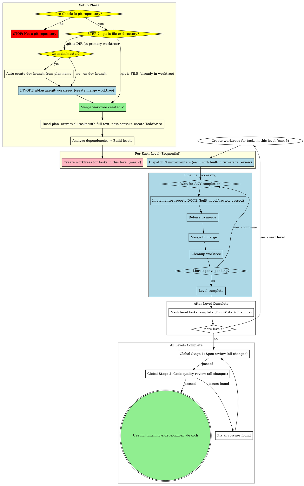

# Parallel Subagent-Driven Development

Execute plan by dispatching fresh subagent per task. Each implementer performs built-in two-stage self-review (spec compliance + code quality) before reporting done. After all tasks complete in all levels, perform global two-stage review on all merged code.

**Why subagents:** You delegate tasks to specialized agents with isolated context. By precisely crafting their instructions and context, you ensure they stay focused and succeed at their task. They should never inherit your session's context or history — you construct exactly what they need. This also preserves your own context for coordination work.

**Core principle:** Fresh subagent per task with built-in two-stage self-review + global review after all tasks = high quality, fast iteration

**Core design:** Parallel mode creates a top-level merge worktree at startup from the development branch. All tasks in each level fork from this merge worktree and merge back to it after completion. After all tasks complete, only the merge worktree remains with all accumulated changes, and `nbl.finishing-a-development-branch` can be used directly.

## NON-NEGOTIABLE Requirements (Read BEFORE Starting)

| Check | Requirement |
|-------|-------------|
| **Worktree Isolation** | MUST create isolated merge worktree via `nbl.using-git-worktrees` before any dispatching. If in primary worktree (`.git` is a directory), invoke `nbl.using-git-worktrees` first. NEVER implement directly in primary worktree. |
| **TDD Required** | Every implementation task MUST invoke `nbl.test-driven-development` skill FIRST. Never write implementation before tests. |
| **Two-Stage Self-Review** | Each implementer MUST complete: Stage 1 (spec compliance, line-by-line check) → Stage 2 (code quality, naming, conventions). Fix issues immediately in each stage. Never report DONE until both stages pass with NO issues. |
| **Merge Lifecycle** | One merge worktree created at startup, ALL task merges go here. MUST NOT delete before all levels complete. After all levels, `finishing-a-development-branch` handles final cleanup. |
| **Directory Safety** | Always `cd` back to project root between Bash commands. Prefer `sub-to-sub-merge` script for merge + cleanup in one step. Never leave CWD inside a nested worktree. |

## Worktree Setup (MANDATORY)

**Full Check Process (execute step-by-step):**

```
STEP 1: Pre-check - Is this a Git repository?
  Execute: git rev-parse --is-inside-work-tree
  If NO → STOP, prompt user to initialize Git
  If YES → continue to STEP 2

STEP 2: Check if already inside an added worktree:
  If .git is a file → INSIDE_ADDED_WORKTREE = YES
  If .git is a directory → INSIDE_ADDED_WORKTREE = NO

STEP 3: If INSIDE_ADDED_WORKTREE = YES:
  → Proceed directly to create merge worktree from current branch

STEP 4: If INSIDE_ADDED_WORKTREE = NO (in primary working tree):
  Get current branch: CURRENT_BRANCH=$(git rev-parse --abbrev-ref HEAD)

  If CURRENT_BRANCH is "main" or "master":
    1. Auto-create development branch from plan name
    2. Checkout new development branch in primary working tree

  // CRITICAL: This step executes for BOTH main/master AND development branches!
  INVOKE: `/nbl.superpowers:nbl.using-git-worktrees create <base-name-merge>`
  // After invocation, you will be inside the newly created merge worktree
  → Setup complete, proceed to read plan and analyze dependencies
```

**Result after setup:**
```
- Base name: `<name>-merge`
- Branch: `feature/{name}-merge`
- Path: `.worktrees/{name}-merge/`
- All subsequent task worktrees will be created from this merge worktree
```

## Level-Based Execution

### Dependency Graph Analysis

```python
# Pseudocode
def analyze_plan(plan):
    for task in plan.tasks:
        if task.dependencies == None:
            task.level = 0
        else:
            task.level = max(dep.level for dep in task.dependencies) + 1

    levels = group_by_level(tasks)
    return levels
```

### Level Semantics

```
Level 0: Task 1, Task 3      # No dependencies
    ↓
Level 1: Task 2, Task 4      # Depends on Level 0
    ↓
Level 2: ...                  # Depends on Level 1
```

**Key insight:** Level describes **dependency constraints**. All tasks in a level must complete before Level+1 starts.

### Pipeline Execution Pattern

```
For each level:
    ├── Create worktrees for tasks in this level (max 2 per batch)
    │   For each task, invoke **nbl.using-git-worktrees** skill with:
    │   - Base name: `<base_name>`
    │   - Task id: `<task_id>`
    │   Skill handles correct path calculation automatically: `.worktrees/{base}-task{id}`
    ├── Dispatch agents in parallel
    ├── Wait all tasks complete (implementer does built-in two-stage self-review)
    ├── Rebase each task branch to merge branch
    ├── Merge all task branches to merge branch
    ├── Mark all completed tasks as done in TodoWrite and plan file
    └── Proceed to next level
```

### Per-Task Rebase + Merge + Cleanup

For each completed agent:

1. **Implementer completes:** implement → spec self-check → fix → quality self-check → fix → DONE
2. **Rebase + Merge + Cleanup** - Invoke `nbl.using-git-worktrees` skill:
   ```
   /nbl.superpowers:nbl.using-git-worktrees merge-sub <base_name> <task_id>
   ```
   > ⚠️ The merge **must** happen inside the merge worktree. Do NOT attempt `git checkout $merge_branch` in the main workspace (Git forbids checking out the same branch in two worktrees simultaneously).

### Level Completion Criteria

| Step | Description | Must Pass? |
|------|-------------|------------|
| 1 | Implementer reports DONE (with built-in self-review passed) | ✅ |
| 2 | Rebase to merge branch | ✅ |
| 3 | Merge to merge branch | ✅ |
| 4 | Mark task statuses complete in plan file | ✅ |

**Key rule:** Level completion = ALL tasks passed ALL steps.

### Failure Handling

If any task fails at any step:
1. **Level is blocked** — do NOT proceed to next level
2. **Fix the failing task** — implementer fixes, re-review if needed
3. **Resume once all tasks pass** — then proceed to next level

| Scenario | Action |
|----------|--------|
| Implementer BLOCKED/NEEDS_CONTEXT | Main agent provides context or re-dispatch |
| Rebase conflict | Follow "Rebase Conflict Resolution" below |
| Merge fails | Rollback, fix, retry |
| **Any task in level fails** | **Whole level blocked** |

**Rule:** One agent failure does not block other parallel agents from executing, but blocks that agent's subsequent merges until fixed.

## Rebase Conflict Resolution

When `git rebase $merge_branch` encounters conflicts:

### Why LLM for Conflicts?

LLMs excel at resolving Git conflicts because they understand semantics: can analyze changes in base vs subagent, merge non-conflicting parts, and resolve most simple conflicts automatically (70-80%). Only complex semantic conflicts require human judgment.

### Resolution Flow

```
1. git rebase $base_branch
2. If conflict:
   a. Get conflict status: git status
   b. Get conflict details: git diff (shows base vs subagent changes)
   c. **Read the full content of all conflicted files** to understand context
   d. LLM analyzes → generates merged code
   e. Write merged files
   f. git add <conflict-files>
   g. git rebase --continue
3. If auto-resolution succeeds → continue normal flow
```

### Escalation

If the conflict is too complex for automatic resolution:

1. `git rebase --abort` — rollback
2. Present conflict details to user
3. Explain why automatic resolution failed
4. User makes decision: manually resolve, provide context for retry, or other approach

**Principle:** Main agent coordinates; user decides on complex conflicts; LLM executes.

| Conflict Type | Action |
|--------------|--------|
| Simple (localized, obvious merge) | LLM auto-resolve |
| Complex (semantic ambiguity) | Escalate to user |

## The Process (WITH NON-NEGOTIABLE GATES)



### Batch Handling for 3+ Tasks

| Tasks in Level | Approach |
|----------------|----------|
| **2 tasks** | Single batch, all agents in parallel |
| **3+ tasks** | Split into batches of 2, process batch by batch |

### Process Gates Summary

| Gate | Location | Requirement |
|------|----------|-------------|
| **GATE 1: Branch Check + Merge Worktree** | BEFORE starting levels | If on main/master → auto-create dev branch. Create merge worktree from dev branch. |
| **GATE 2: TDD** | Implementer phase | MUST invoke `nbl.test-driven-development` skill |
| **GATE 3: Built-In Self-Review** | Implementer phase | Two-stage self-review before reporting DONE |
| **GATE 4: Global Spec Review** | After all levels | MUST invoke spec reviewer on all merged changes |
| **GATE 5: Global Quality Review** | After global spec review | MUST invoke code quality reviewer on all merged changes |

## Model Selection

Use the least powerful model that can handle each role:

- **Mechanical tasks** (1-2 files, clear specs) → fast, cheap model
- **Integration tasks** (multi-file, pattern matching) → standard model
- **Architecture/review tasks** → most capable model

## Handling Implementer Status

- **DONE:** Completed + passed two-stage self-review. Mark complete, proceed to rebase/merge.
- **DONE_WITH_CONCERNS:** Completed but flagged doubts. Read concerns; address correctness/scope issues before merging.
- **NEEDS_CONTEXT:** Missing information. Provide context and re-dispatch.
- **BLOCKED:** Cannot complete. Assess: provide context → upgrade model → break into smaller tasks → escalate to human.

**Never** ignore an escalation or force the same model to retry without changes.

## Prompt Templates

Prompt templates are shared with serial subagent-driven-development:
- `../nbl.subagent-driven-development/implementer-prompt.md` - Dispatch implementer subagent
- `../nbl.subagent-driven-development/spec-reviewer-prompt.md` - Dispatch spec compliance reviewer subagent
- `../nbl.subagent-driven-development/code-quality-reviewer-prompt.md` - Dispatch code quality reviewer subagent

## Red Flags (Never Do This)

- Execute on main/master without user consent
- Dispatch implementer without worktree isolation
- Accept DONE before two-stage review completes
- Skip TDD
- Proceed with unfixed self-review issues
- Make subagent read plan file (provide full text instead)
- Skip scene-setting context for subagent
- Ignore subagent questions
- Dispatch more than 2 agents simultaneously
- Merge without rebasing first
- Proceed to next level with failed agents
- Skip the final global two-stage review

If global reviewer finds issues: dispatch fix subagent with specific instructions → re-review after fixes. Don't fix manually (context pollution).

## Integration

**Required workflow skills:**
- **nbl.using-git-worktrees** - REQUIRED: Set up isolated worktrees before each level
- **nbl.writing-plans** - Creates the plan this skill executes (with task dependencies)
- **nbl.requesting-code-review** - Code review template for reviewer subagents
- **nbl.finishing-a-development-branch** - Complete development after all tasks are merged

**Subagents should use:**
- **nbl.test-driven-development** - Subagents follow TDD for each task
