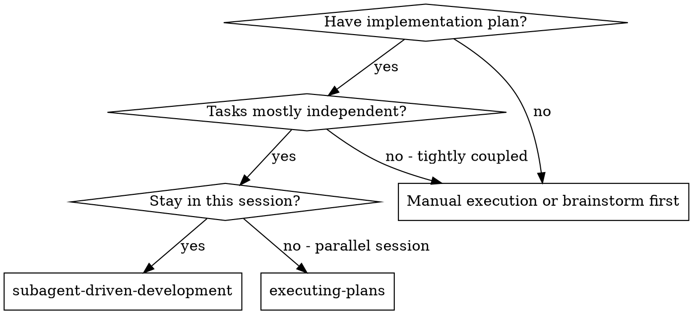
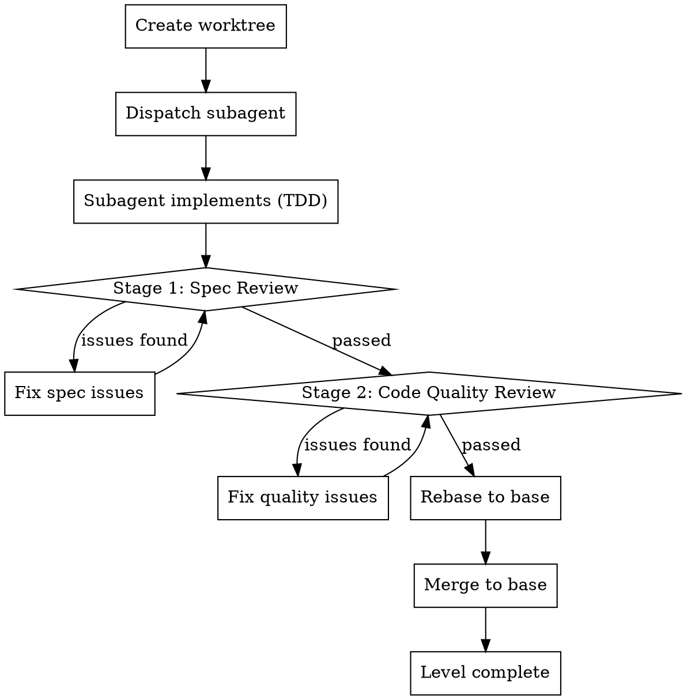
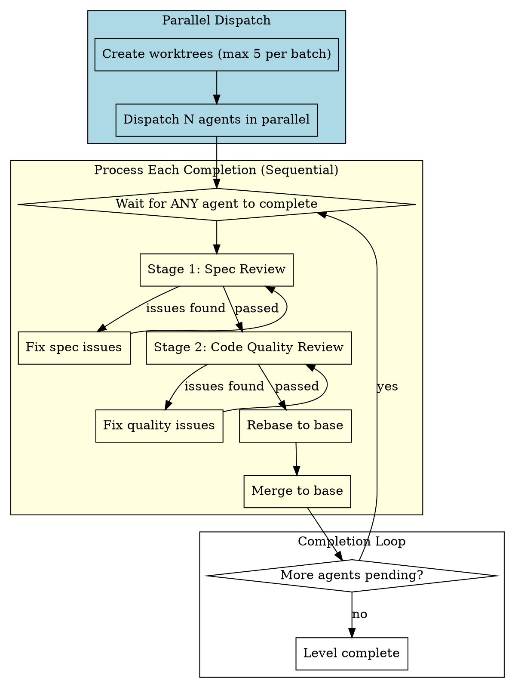
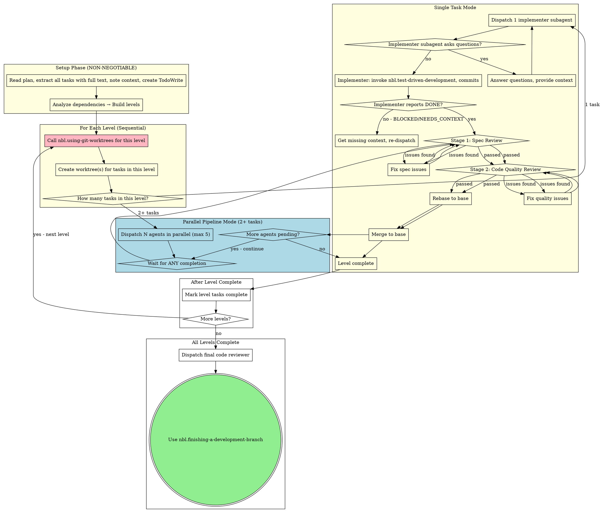

# Subagent-Driven Development

Execute plan by dispatching fresh subagent per task, with two-stage review after each: spec compliance review first, then code quality review.

**Why subagents:** You delegate tasks to specialized agents with isolated context. By precisely crafting their instructions and context, you ensure they stay focused and succeed at their task. They should never inherit your session's context or history — you construct exactly what they need. This also preserves your own context for coordination work.

**Core principle:** Fresh subagent per task + two-stage review (spec then quality) = high quality, fast iteration

## ⛔ STOP: Read Before ANY Action

```
┌─────────────────────────────────────────────────────────────────┐
│  BEFORE reading plan, BEFORE creating tasks, BEFORE anything:   │
│                                                                 │
│  1. Are you on main/master branch? → MUST call worktree skill   │
│  2. Already in a worktree? → Skip to "Read Plan" section        │
│                                                                 │
│  NEVER dispatch implementer on main/master without worktree     │
└─────────────────────────────────────────────────────────────────┘
```

## NON-NEGOTIABLE Requirements (Read BEFORE Starting)

**You MUST complete these checks before dispatching ANY implementer subagent:**

<NON_NEGOTIABLE>

### 1. Worktree Setup (MANDATORY)

```
Before each level:
├── Isolated workspace? → Call nbl.using-git-worktrees
│   ├── Single task in level → Single worktree
│   └── Multiple tasks in level → Batch worktrees (max 5)
└── Verify: git worktree list shows your worktree(s)
```

**Never:** Dispatch implementer on main/master branch without worktree isolation

### 2. TDD Required (MANDATORY)

```
Every implementation task MUST:
├── Invoke nbl.test-driven-development skill FIRST
├── Skill guides RED→GREEN→REFACTOR cycle
└── Never write implementation before tests
```

**Never:** Skip TDD skill, write implementation before tests

### 3. Two-Stage Review (MANDATORY)

```
After implementer completes:
├── Stage 1: Spec compliance review
│   ├── Invoke nbl.requesting-code-review skill
│   ├── Use spec-reviewer-prompt.md template
│   ├── ❌ Issues? → Implementer fixes → Re-review
│   └── ✅ Pass → Proceed to Stage 2
├── Stage 2: Code quality review
│   ├── Invoke nbl.requesting-code-review skill
│   ├── Use code-quality-reviewer-prompt.md template
│   ├── ❌ Issues? → Implementer fixes → Re-review
│   └── ✅ Pass → Task complete
└── Never skip either stage
```

**Never:**
- Let implementer self-review replace actual review
- Skip spec compliance review
- Skip code quality review
- Proceed to next task with open review issues

</NON_NEGOTIABLE>

## When to Use



**vs. Executing Plans (parallel session):**
- Same session (no context switch)
- Fresh subagent per task (no context pollution)
- Two-stage review after each task: spec compliance first, then code quality
- Faster iteration (no human-in-loop between tasks)

## Level-Based Execution

### Dependency Graph Analysis

```python
# Pseudocode
def analyze_plan(plan):
    for task in plan.tasks:
        if task.dependencies == None:
            task.level = 0
        else:
            task.level = max(dep.level for dep in task.dependencies) + 1

    levels = group_by_level(tasks)
    return levels
```

### Level Semantics

```
Level 0: Task 1, Task 3      # No dependencies
        ↓
Level 1: Task 2, Task 4      # Depends on Level 0
        ↓
Level 2: ...                  # Depends on Level 1
```

**Key insight:** Level describes **dependency constraints**, not execution mode.
- All tasks in a level must complete before Level+1 starts (regardless of how many)
- "Serial" = chain dependencies = many levels with 1 task each
- "Parallel" = flat dependencies = few levels with many tasks each

### Unified Execution Pattern

```
For each level:
    ├── Create worktree(s) for tasks in this level
    ├── Execute tasks (mode depends on count)
    │     ├── Single task → Simple mode (no pipeline overhead)
    │     └── Multiple tasks → Pipeline mode (process as each completes)
    ├── Wait all tasks in level complete (ALL steps)
    └── Proceed to next level
```

### Level Completion Criteria

**All tasks must complete ALL steps before next level:**

| Step | Description | Must Pass? |
|------|-------------|------------|
| 1 | Implementer reports DONE | ✅ |
| 2 | Spec compliance review | ✅ |
| 3 | Code quality review | ✅ |
| 4 | Rebase to base | ✅ |
| 5 | Merge to base | ✅ |

**Key rule:** Level completion = ALL tasks passed ALL steps.

### Failure Handling

If any task fails at any step:
1. **Level is blocked** — do NOT proceed to next level
2. **Fix the failing task** — implementer fixes, re-review
3. **Resume once all tasks pass** — then proceed to next level

## Single-Task Execution

When a level has exactly **one task**:

### Execution Flow



**No pipeline overhead:** Since only one task, no need to "wait for any completion" or check "more agents pending".

## Pipeline Mode Detail

This section documents the detailed flow for multi-task levels. See "The Process" diagram above for the unified view.

### Pipeline Flow



### Key Differences: Single vs Pipeline

| Aspect | Single Task Mode | Pipeline Mode |
|--------|-----------------|--------------|
| Worktrees | 1 | Up to 5 (or batched) |
| Dispatch | Sequential (wait for completion) | Parallel (all at once) |
| Result processing | After single completes | As each completes |
| Pipeline overhead | None | "Wait for completion" loop |

**Pipeline benefit:** As soon as any agent completes, start processing its review/merge without waiting for slower agents.

### Per-Task Rebase + Merge Process

For each completed agent:

1. **Stage 1: Spec Review** - Verify implementation matches spec
2. **Stage 2: Code Quality Review** - Verify code quality
3. **Fix Issues** - If either stage fails, implementer fixes and re-reviews
4. **Rebase** - `git rebase $base_branch` (handle conflicts if any)
   - `$base_branch` is the branch we created worktrees from (e.g., main, dev, master)
5. **Merge** - `git merge --ff-only $base_branch` into $base_branch
6. **Keep worktree** - Cleanup will happen after all tasks complete in `finishing-a-development-branch`

### Error Handling

| Scenario | Action |
|----------|--------|
| Spec review fails | Implementer fixes spec gaps, re-review |
| Code quality review fails | Implementer fixes quality issues, re-review |
| Agent blocked | Main agent provides context or re-dispatches |
| Rebase conflict | Follow "Rebase Conflict Resolution" section below |
| Merge fails | Rollback, fix, retry |
| **Any task in level fails** | **Whole level blocked — do NOT proceed to next level** |

**Rule:** One agent failure does not block other parallel agents from executing, but blocks that agent's subsequent merges until fixed. Any failure at the level level blocks the entire level from completing.

## Rebase Conflict Resolution

When `git rebase $base_branch` encounters conflicts, use the following process:

### Why LLM for Conflicts?

Large language models excel at resolving Git conflicts because they understand semantics:
- Can analyze what changed in base vs what the subagent changed
- Can intelligently merge non-conflicting parts
- Can resolve most simple conflicts automatically (70-80%)
- Only complex semantic conflicts require human judgment

### Resolution Flow

```
1. git rebase $base_branch
2. If conflict:
   a. Get conflict status: git status
   b. Get conflict details: git diff (shows base vs subagent changes)
   c. LLM analyzes → generates merged code
   d. Write merged files
   e. git add <conflict-files>
   f. git rebase --continue
3. If auto-resolution succeeds → continue normal flow
```

### Escalation: When Auto-Resolution Fails

If the conflict is too complex for automatic resolution:

1. `git rebase --abort` — rollback to state before rebase attempt
2. Present conflict details to user
3. Explain why automatic resolution failed
4. User makes decision:
   - Manually resolve themselves
   - Provide additional context for retry
   - Other approach

### Key Principle

**Main agent coordinates; user decides on complex conflicts; LLM executes.**

| Conflict Type | Action |
|--------------|--------|
| Simple (localized, obvious merge) | LLM auto-resolve |
| Complex (semantic ambiguity) | Escalate to user |

### Example: Auto-Resolution in Action

```
> git rebase main
Auto-merging src/utils.js
CONFLICT (content): Merge conflict in src/utils.js

Main agent: Analyzing conflict...

Base version:  modified formatDate() to use locale parameter
Subagent version: added timezone support to formatDate()

LLM decision: Keep both changes — add timezone parameter with locale fallback.
Result: formatDate(date, { locale: 'en-US', timezone: 'UTC' })

> git add src/utils.js
> git rebase --continue
Rebase successful.
```

## The Process (WITH NON-NEGOTIABLE GATES)



### Execution Mode Decision

| Level Tasks | Mode | Worktrees | Dispatch | Pipeline Overhead |
|-------------|------|-----------|----------|-------------------|
| **1 task** | Single Task | 1 | 1 agent | None |
| **2-5 tasks** | Pipeline | Up to 5 | N agents in parallel | Wait for completion |
| **6+ tasks** | Batch Pipeline | Split into batches of 5 | Batch 1 first, then batch 2 | Wait for batch complete |

**Key insight:** Both modes use the same review flow (spec → quality → rebase → merge). Pipeline mode adds "wait for any completion" loop to process results as agents finish.

### Process Gates Summary

| Gate | Location | Requirement |
|------|----------|-------------|
| **GATE 1: Worktree** | Before each level | MUST call `nbl.using-git-worktrees` for tasks in current level |
| **GATE 2: TDD** | Implementer phase | MUST invoke `nbl.test-driven-development` skill |
| **GATE 3: Spec Review** | After implementer | MUST invoke `nbl.requesting-code-review` with spec-reviewer template |
| **GATE 4: Quality Review** | After spec review | MUST invoke `nbl.requesting-code-review` with code-quality template |

## Model Selection

Use the least powerful model that can handle each role to conserve cost and increase speed.

**Mechanical implementation tasks** (isolated functions, clear specs, 1-2 files): use a fast, cheap model. Most implementation tasks are mechanical when the plan is well-specified.

**Integration and judgment tasks** (multi-file coordination, pattern matching, debugging): use a standard model.

**Architecture, design, and review tasks**: use the most capable available model.

**Task complexity signals:**
- Touches 1-2 files with a complete spec → cheap model
- Touches multiple files with integration concerns → standard model
- Requires design judgment or broad codebase understanding → most capable model

## Handling Implementer Status

Implementer subagents report one of four statuses. Handle each appropriately:

**DONE:** Proceed to spec compliance review.

**DONE_WITH_CONCERNS:** The implementer completed the work but flagged doubts. Read the concerns before proceeding. If the concerns are about correctness or scope, address them before review. If they're observations (e.g., "this file is getting large"), note them and proceed to review.

**NEEDS_CONTEXT:** The implementer needs information that wasn't provided. Provide the missing context and re-dispatch.

**BLOCKED:** The implementer cannot complete the task. Assess the blocker:
1. If it's a context problem, provide more context and re-dispatch with the same model
2. If the task requires more reasoning, re-dispatch with a more capable model
3. If the task is too large, break it into smaller pieces
4. If the plan itself is wrong, escalate to the human

**Never** ignore an escalation or force the same model to retry without changes. If the implementer said it's stuck, something needs to change.

## Handling Multiple Parallel Questions

When multiple agents are running in parallel (Pipeline mode), multiple agents may ask clarifying questions at different times. Use a **FIFO queue** to manage pending questions:

### Algorithm

```
Maintain: pending_questions = FIFO queue
Maintain: currently_answering = null

When an agent asks a question:
    Add (task_id, question, agent_context) to pending_questions
    If currently_answering is null:
        Dequeue → present question to user
        currently_answering = this question

When user answers the current question:
    Send answer back to the asking agent
    Agent continues execution
    currently_answering = null
    If pending_questions not empty:
        Dequeue next → present to user
        currently_answering = next question

When any agent completes implementation:
    If it has no pending questions → proceed to review
    If it has questions waiting → stays queued until answered
```

### Key Rules

1. **One question at a time to the user** - Never overwhelm user with multiple simultaneous questions
2. **FIFO ordering** - Questions are answered in the order they arrive
3. **Other agents keep running** - Question queuing doesn't block other agents from continuing
4. **No forced waiting** - First question to arrive is first to be answered, no need to wait for "all questions to arrive"
5. **Implementation completion doesn't skip queue** - Even if an agent finishes implementation before its question is answered, it still waits its turn in the queue

### Example: 3 Parallel Agents

```
Dispatch 3 agents → pending = [], current = null
Agent B asks question → pending = [B], current = B → present B to user
  While user answering B: Agent A asks → pending = [A]
  While user answering B: Agent C asks → pending = [A, C]
User answers B → B resumes → pending = [A], current = A → present A
User answers A → A resumes → pending = [C], current = C → present C
User answers C → C resumes → pending = [], current = null → wait for completion
```

## Prompt Templates

- `./implementer-prompt.md` - Dispatch implementer subagent
- `./spec-reviewer-prompt.md` - Dispatch spec compliance reviewer subagent
- `./code-quality-reviewer-prompt.md` - Dispatch code quality reviewer subagent

## Example Workflow

```
You: I'm using Subagent-Driven Development to execute this plan.

[Read plan file once: docs/nbl/plans/feature-plan.md]
[Extract all 5 tasks with full text and context]
[Create TodoWrite with all tasks]

Task 1: Hook installation script

[Get Task 1 text and context (already extracted)]
[Dispatch implementation subagent with full task text + context]

Implementer: "Before I begin - should the hook be installed at user or system level?"

You: "User level (~/.config/nbl/hooks/)"

Implementer: "Got it. Implementing now..."
[Later] Implementer:
  - Implemented install-hook command
  - Added tests, 5/5 passing
  - Self-review: Found I missed --force flag, added it
  - Committed

[Dispatch spec compliance reviewer]
Spec reviewer: ✅ Spec compliant - all requirements met, nothing extra

[Get git SHAs, dispatch code quality reviewer]
Code reviewer: Strengths: Good test coverage, clean. Issues: None. Approved.

[Mark Task 1 complete]

Task 2: Recovery modes

[Get Task 2 text and context (already extracted)]
[Dispatch implementation subagent with full task text + context]

Implementer: [No questions, proceeds]
Implementer:
  - Added verify/repair modes
  - 8/8 tests passing
  - Self-review: All good
  - Committed

[Dispatch spec compliance reviewer]
Spec reviewer: ❌ Issues:
  - Missing: Progress reporting (spec says "report every 100 items")
  - Extra: Added --json flag (not requested)

[Implementer fixes issues]
Implementer: Removed --json flag, added progress reporting

[Spec reviewer reviews again]
Spec reviewer: ✅ Spec compliant now

[Dispatch code quality reviewer]
Code reviewer: Strengths: Solid. Issues (Important): Magic number (100)

[Implementer fixes]
Implementer: Extracted PROGRESS_INTERVAL constant

[Code reviewer reviews again]
Code reviewer: ✅ Approved

[Mark Task 2 complete]

...

[After all tasks]
[Dispatch final code-reviewer]
Final reviewer: All requirements met, ready to merge

Done!
```

## Advantages

**vs. Manual execution:**
- Subagents follow TDD naturally
- Fresh context per task (no confusion)
- Parallel-safe (subagents don't interfere)
- Subagent can ask questions (before AND during work)

**vs. Executing Plans:**
- Same session (no handoff)
- Continuous progress (no waiting)
- Review checkpoints automatic

**Efficiency gains:**
- No file reading overhead (controller provides full text)
- Controller curates exactly what context is needed
- Subagent gets complete information upfront
- Questions surfaced before work begins (not after)

**Quality gates:**
- Self-review catches issues before handoff
- Two-stage review: spec compliance, then code quality
- Review loops ensure fixes actually work
- Spec compliance prevents over/under-building
- Code quality ensures implementation is well-built

**Cost:**
- More subagent invocations (implementer + 2 reviewers per task)
- Controller does more prep work (extracting all tasks upfront)
- Review loops add iterations
- But catches issues early (cheaper than debugging later)

## Red Flags

**Never:**
- Dispatch an implementer without worktree isolation (MUST call `nbl.using-git-worktrees` first, always required regardless of current branch)
- Skip reviews (spec compliance OR code quality)
- Proceed with unfixed issues
- Make subagent read plan file (provide full text instead)
- Skip scene-setting context (subagent needs to understand where task fits)
- Ignore subagent questions (answer before letting them proceed)
- Accept "close enough" on spec compliance (spec reviewer found issues = not done)
- Skip review loops (reviewer found issues = implementer fixes = review again)
- Let implementer self-review replace actual review (both are needed)
- **Start code quality review before spec compliance is ✅** (wrong order)
- Move to next task while either review has open issues
- Dispatch more than 5 agents simultaneously
- Skip CR before merge
- Merge without rebasing first
- Proceed to next level with failed agents
- Ignore rebase conflicts
- In single worktree mode: dispatch multiple implementation subagents in parallel (conflicts - one directory can't handle multiple parallel edits)

**If subagent asks questions:**
- Answer clearly and completely
- Provide additional context if needed
- Don't rush them into implementation

**If reviewer finds issues:**
- Implementer (same subagent) fixes them
- Reviewer reviews again
- Repeat until approved
- Don't skip the re-review

**If subagent fails task:**
- Dispatch fix subagent with specific instructions
- Don't try to fix manually (context pollution)

## Integration

**Required workflow skills:**
- **nbl.using-git-worktrees** - REQUIRED: Set up isolated worktrees before each level (single or batch mode)
- **nbl.writing-plans** - Creates the plan this skill executes (with task dependencies)
- **nbl.requesting-code-review** - Code review template for reviewer subagents
- **nbl.finishing-a-development-branch** - Complete development after all tasks are merged

**Subagents should use:**
- **nbl.test-driven-development** - Subagents follow TDD for each task

**Alternative workflow:**
- **nbl.executing-plans** - Use for parallel session instead of same-session execution

**Multi-task level integration:**
- Creates batch worktrees for multiple parallel tasks (max 5)
- Uses pipeline flow: process each task as it completes
- Uses rebase + merge for each completed task
- Main agent handles rebase conflicts
- Single-task level uses simple mode with no pipeline overhead
