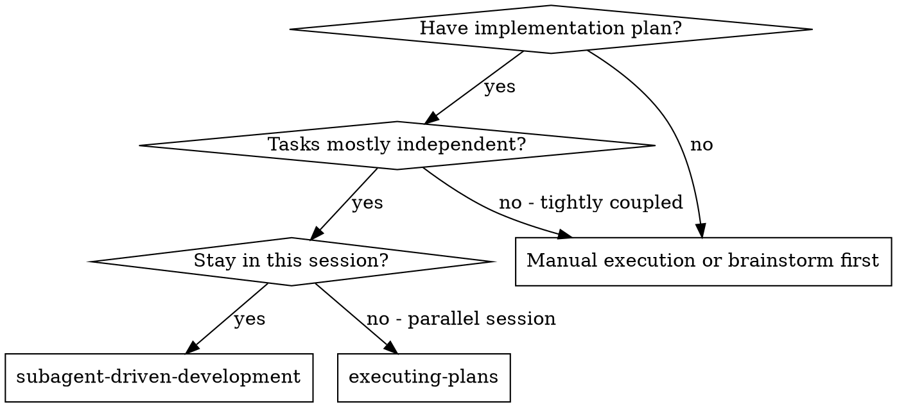
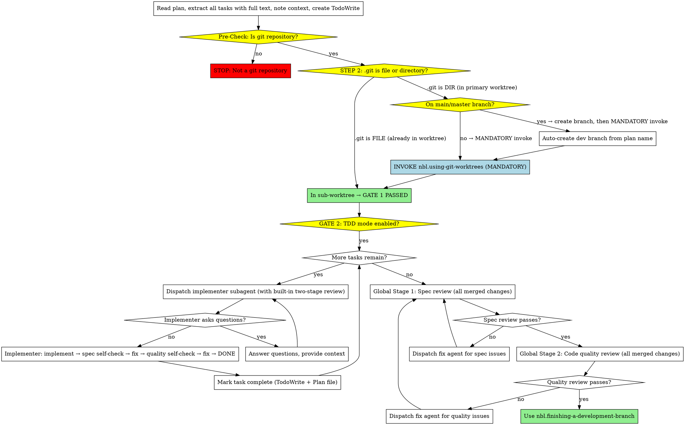

# Subagent-Driven Development

Execute plan by dispatching fresh subagent per task. Each implementer performs built-in two-stage self-review (spec compliance + code quality) before reporting done. After all tasks complete, perform global two-stage review on all merged code.

**Why subagents:** You delegate tasks to specialized agents with isolated context. By precisely crafting their instructions and context, you ensure they stay focused and succeed at their task. They should never inherit your session's context or history — you construct exactly what they need. This also preserves your own context for coordination work.

**Core principle:** Fresh subagent per task with built-in two-stage self-review + global review after all tasks = high quality, fast iteration

## When to Use



**vs. Executing Plans (parallel session):**
- Same session (no context switch)
- Fresh subagent per task (no context pollution)
- Built-in two-stage self-review per task (spec compliance + code quality)
- Final global two-stage review on all merged code
- Faster iteration (no human-in-loop between tasks)

## NON-NEGOTIABLE GATES

Before any task execution, these gates MUST pass:

**GATE 1: Git Worktree Isolation**

<NON_NEGOTIABLE>

**CRITICAL RULE:**
> **If you are in the primary working tree (`.git` is a directory)**, regardless of whether you are on `main`/`master` or already on a development branch, you **MUST** invoke `nbl.using-git-worktrees` to create an isolated sub-worktree before dispatching any implementer. **NO EXCEPTIONS.**

> Primary working tree is for branch management only. ALL implementation tasks run in isolated sub-worktrees. Never implement directly in primary worktree.

</NON_NEGOTIABLE>

- **Pre-Check: Must be a Git repository**
  - Check if current directory is a Git repository
  - If **NOT** a Git repository → **STOP immediately** and tell the user:
    > "Error: nbl.subagent-driven-development requires a Git repository. Please run `git init` to initialize a repository, then retry."

**Typical Usage Pattern (our convention):**
> User ALWAYS starts Claude Code in the **main working tree** (primary worktree). The skill creates the isolated worktree, user doesn't manually cd into worktrees to start Claude Code.

**FULL Check Process (execute step-by-step, NO shortcuts):**

```
STEP 1: Pre-check - Is this a Git repository?
  Execute: git rev-parse --is-inside-work-tree
  If NO → STOP, prompt user to initialize Git
  If YES → continue to STEP 2

STEP 2: Check if already inside an added worktree:
  If .git is a file → INSIDE_ADDED_WORKTREE = YES
  If .git is a directory → INSIDE_ADDED_WORKTREE = NO

STEP 3: If INSIDE_ADDED_WORKTREE = YES:
  → GATE 1 PASSED → proceed directly to GATE 2
  → STOP HERE, do NOT create another worktree

STEP 4: If INSIDE_ADDED_WORKTREE = NO (in primary working tree):
  Get current branch: CURRENT_BRANCH=$(git rev-parse --abbrev-ref HEAD

  If CURRENT_BRANCH is "main" or "master":
    1. Auto-create development branch from plan name
    2. Checkout new development branch in primary working tree

  // CRITICAL: This step executes for BOTH main/master AND development branches!
  INVOKE: `/nbl.superpowers:nbl.using-git-worktrees create <base-name-from-plan>
  // After invocation, you will be inside the newly created worktree
  → GATE 1 PASSED → proceed to GATE 2
```

**MUST create isolated worktree before starting implementation, NO exceptions.**

**GATE 2: Test-Driven Development**
- All implementation MUST follow TDD: write failing test → implement → verify pass
- Subagents receive explicit TDD instructions in their prompt
- No "implement first, test later" allowed

**GATE 3: Built-In Two-Stage Self-Review**
- Each implementer MUST perform two-stage self-review before reporting DONE:
  1. Spec compliance check - fix any issues found
  2. Code quality check - fix any issues found
- Only report DONE after both stages pass with no issues
- This is NON-NEGOTIABLE - do not accept DONE without self-review results

**These gates are NON-NEGOTIABLE.** Skip them only if user explicitly overrides.

## The Process



After both reviews pass:

**All implementation is complete in the isolated worktree.** Enter `nbl.finishing-a-development-branch` to handle merge and cleanup.

## Model Selection

Use the least powerful model that can handle each role to conserve cost and increase speed.

**Mechanical implementation tasks** (isolated functions, clear specs, 1-2 files): use a fast, cheap model. Most implementation tasks are mechanical when the plan is well-specified.

**Integration and judgment tasks** (multi-file coordination, pattern matching, debugging): use a standard model.

**Architecture, design, and review tasks**: use the most capable available model.

**Task complexity signals:**
- Touches 1-2 files with a complete spec → cheap model
- Touches multiple files with integration concerns → standard model
- Requires design judgment or broad codebase understanding → most capable model

## Handling Implementer Status

Implementer subagents report one of four statuses. Handle each appropriately:

**DONE:** Implementer completed the work **and** passed built-in two-stage self-review with all issues fixed. **Mark task complete in both TodoWrite and the plan file (update the checkbox from `[ ]` to `[x]`)**, then proceed to next task.

**DONE_WITH_CONCERNS:** The implementer completed the work but flagged doubts. Read the concerns before proceeding. If the concerns are about correctness or scope, address them before moving on. If they're observations (e.g., "this file is getting large"), note them and **mark task complete in both TodoWrite and the plan file**.

**NEEDS_CONTEXT:** The implementer needs information that wasn't provided. Provide the missing context and re-dispatch.

**BLOCKED:** The implementer cannot complete the task. Assess the blocker:
1. If it's a context problem, provide more context and re-dispatch with the same model
2. If the task requires more reasoning, re-dispatch with a more capable model
3. If the task is too large, break it into smaller pieces
4. If the plan itself is wrong, escalate to the human

**Never** ignore an escalation or force the same model to retry without changes. If the implementer said it's stuck, something needs to change.

## Prompt Templates

- `./implementer-prompt.md` - Dispatch implementer subagent
- `./spec-reviewer-prompt.md` - Dispatch spec compliance reviewer subagent
- `./code-quality-reviewer-prompt.md` - Dispatch code quality reviewer subagent

## Example Workflow

```
You: I'm using Subagent-Driven Development to execute this plan.

[Read plan file once: docs/nbl/plans/feature-plan.md]
[Extract all 5 tasks with full text and context]
[Create TodoWrite with all tasks]

Task 1: Hook installation script

[Get Task 1 text and context (already extracted)]
[Dispatch implementation subagent with full task text + context]

Implementer: "Before I begin - should the hook be installed at user or system level?"

You: "User level (~/.config/nbl/hooks/)"

Implementer: "Got it. Implementing now..."
[Later] Implementer:
  - Implemented install-hook command
  - Added tests, 5/5 passing
  - **Built-in Two-Stage Review Results:**
    - Stage 1 (Spec Compliance): PASSED
    - Stage 2 (Code Quality): PASSED
  - Committed

[Mark Task 1 complete in TodoWrite, mark all statuses complete in plan file]

Task 2: Recovery modes

[Get Task 2 text and context (already extracted)]
[Dispatch implementation subagent with full task text + context]

Implementer: [No questions, proceeds]
Implementer:
  - Added verify/repair modes
  - 8/8 tests passing
  - **Built-in Two-Stage Review Results:**
    - Stage 1 (Spec Compliance): FIXED - Missing progress reporting, extra --json flag
    - Stage 2 (Code Quality): FIXED - Extracted magic number 100 to PROGRESS_INTERVAL constant
  - Committed

[Mark Task 2 complete in TodoWrite, mark all statuses complete in plan file]

...

[After all tasks complete]
[Get BASE_SHA and HEAD_SHA]
[Dispatch global spec reviewer on all changes]
Spec reviewer: ✅ All changes spec compliant

[Dispatch global code quality reviewer on all changes]
Code reviewer: ✅ All changes meet quality standards

[Invoke nbl.finishing-a-development-branch]

Done!
```

## Advantages

**vs. Manual execution:**
- Subagents follow TDD naturally
- Fresh context per task (no confusion)
- Parallel-safe (subagents don't interfere)
- Subagent can ask questions (before AND during work)

**vs. Executing Plans:**
- Same session (no handoff)
- Continuous progress (no waiting)
- Review checkpoints automatic

**Efficiency gains:**
- No file reading overhead (controller provides full text)
- Controller curates exactly what context is needed
- Subagent gets complete information upfront
- Questions surfaced before work begins (not after)

**Quality gates:**
- Implementer finds and fixes issues before returning to main agent
- Two-stage review still happens (just inside the implementer)
- Final global review ensures quality across all changes
- Same quality guarantees with fewer coordination steps

**Efficiency:**
- One subagent invocation per task (with built-in two-stage review)
- Fewer round-trips between main agent and subagents
- Faster overall execution because implementer fixes issues before returning
- Catches issues early (cheaper than debugging later)

## Red Flags

**Never (NON-NEGOTIABLE):**
- **Start implementation without git worktree** - MUST invoke nbl.using-git-worktrees first
- **Skip TDD** - "implement first, test later" is forbidden
- **Accept DONE before built-in two-stage review completes** - MUST verify implementer performed both stages

**Never:**
- Start implementation on main/master branch without explicit user consent
- Dispatch multiple implementation subagents in parallel (conflicts)
- Make subagent read plan file (provide full text instead)
- Skip scene-setting context (subagent needs to understand where task fits)
- Ignore subagent questions (answer before letting them proceed)
- Move to next task with unfixed issues from self-review
- Skip the final global two-stage review after all tasks complete

**If subagent asks questions:**
- Answer clearly and completely
- Provide additional context if needed
- Don't rush them into implementation

**If global reviewer finds issues after all tasks complete:**
- Dispatch fix subagent with specific instructions
- Fix issues found by reviewers
- Re-review after fixes
- Don't try to fix manually (context pollution)

## Integration

**NON-NEGOTIABLE Requirements:**
- **nbl.using-git-worktrees** - MUST invoke before first task. No exceptions.
- **nbl.test-driven-development** - MUST follow TDD for all implementation. No exceptions.

**Supporting skills:**
- **nbl.writing-plans** - Creates the plan this skill executes
- **nbl.requesting-code-review** - Code review template for final global review
- **nbl.finishing-a-development-branch** - Complete development after all tasks merged

**Prompt templates:**
- `./implementer-prompt.md` - Implementer with built-in two-stage self-review
- `./spec-reviewer-prompt.md` - For final global spec compliance review
- `./code-quality-reviewer-prompt.md` - For final global code quality review

**Alternative workflow:**
- **nbl.parallel-subagent-driven-development** - Use for parallel execution with same flow
